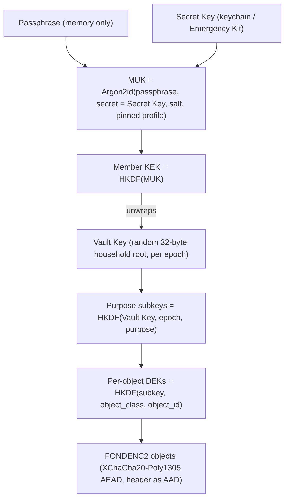
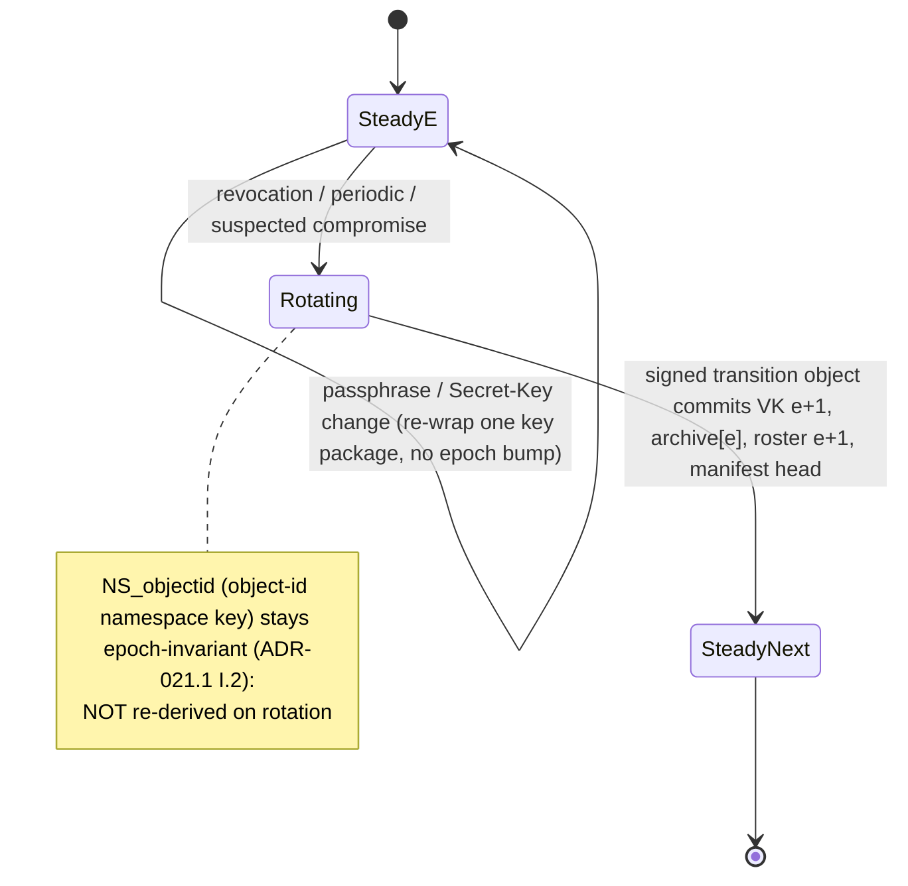
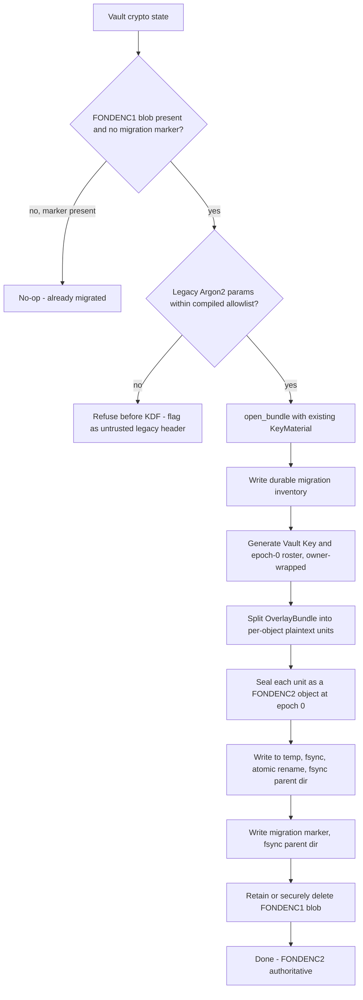

# ADR-020: On-device-first identity & the zero-knowledge account model

**Status**: Proposed
**Date**: 2026-07-24
**Decision**: Establish a **local, two-secret keyset** (passphrase + device-generated Secret Key →
Master Unlock Key → wrapped **household** Vault Key) created **lazily** on first encrypted-export or
sync opt-in — **not** an account on first run. An "account" is created only later, when the user
binds the keyset to a server (ADR-021) by attaching a PAKE verifier. Moving already-encrypted local
data to a server requires a one-time migration from today's single-key **`FONDENC1`** envelope to a
versioned **`FONDENC2`** key hierarchy (there is no key hierarchy today — see Context), after which
further transfers need no re-encryption. This keeps the README's *"no accounts, no cloud"* promise
for the default experience while making fond zero-knowledge-ready for optional sync.
**This ADR is contingent on the Epic A0 protocol spec + independent crypto review (tracked in the
ZK-Sync epic; see GitHub milestone *Zero-Knowledge Sync*);
no crypto code lands before that sign-off.** Extends ADR-005 (identity); **supersedes the single-key
model of ADR-019** by introducing a key hierarchy and `FONDENC2`.

## Context

fond is local-first with `.cook` files as the source of truth (ADR-002) and today has **no accounts
and no auth** (ADR-005 defers identity; README: *"No accounts. No cloud dependency."*). ADR-019
added opt-in symmetric encryption of the authored-overlay sidecar. **Ground truth from
`crates/fond-store/src/crypto.rs`:** `seal_bundle`/`open_bundle` seal one whole `OverlayBundle` under
a **single flat key** (raw keychain key *or* Argon2id-from-passphrase) in a `FONDENC1` envelope.
There is **no** Vault Key, no wrapped-key hierarchy, and no per-object encryption today. Two
consequences follow: (a) "no re-encryption when moving to a server" is **false as-is** — a hierarchy
must be introduced first (`FONDENC2`); (b) `open_bundle` reads Argon2 cost parameters from the
envelope header and derives **before** authenticating, a pre-auth resource-exhaustion vector when the
envelope comes from an untrusted server.

The product now wants an **optional** path to sync data across devices through a server (ADR-021),
with every synced byte end-to-end encrypted 1Password-style so no server operator can read it. That
raises a paradox: the user should be able to "create an account," but there may be no server — ever.
Where does the account live, and how do we avoid breaking the local-first, no-account promise?

The resolution must also honor **Principle #3 (family-shared)**: a household has multiple members,
so the vault must be a **multi-member** vault (per-member wrapped Vault Key, device enrollment,
revocation), not a single-person keyset. `user_id` (ADR-005) is a DB row, not a cryptographic
identity, and does not satisfy this on its own.

## Threat model

**In scope:** an attacker who later gains access to a sync server or its backups (ADR-021) must
learn nothing about recipe content, notes, or photos. Offline brute-force of a stolen server
verifier must be infeasible.

**Out of scope:** a compromised local device with keys available (OS/device hygiene, ADR-019); the
plaintext `.cook` files at rest (OS full-disk encryption, ADR-019). Losing **either** the passphrase
**or** the Secret Key is unrecoverable **by design** (both are required to derive the MUK) — mitigated
by the Emergency Kit and, *for recipes that still exist on a surviving device*, by the plaintext
`.cook` ownership backstop. The backstop does **not** recover overlay data, server-only photos, or
deleted history.

## Decision

### Identity ≠ account

- **Identity** is local and always available: a keyset that can encrypt data on-device.
- **Account** is remote and lazy: a keyset bound to a server with an auth verifier (ADR-021).

### The local keyset (two-secret model)

1. **Secret Key** — a random, high-entropy, device-generated secret. Stored in the OS keychain and
   surfaced once in an **Emergency Kit**. **Never leaves the device; never sent to any server.**
2. **Passphrase** — user-chosen; held in memory only; never stored; never sent.
3. **Master Unlock Key (MUK)** = `Argon2id(passphrase, secret=Secret Key, salt, pinned params)`.
   Never stored; re-derived on unlock. KDF profiles are **pinned/versioned**; parameters are bounded
   by a compiled allowlist **before** derivation (closes the `open_bundle` pre-auth DoS) and
   additionally authenticated by the wrap AEAD tag **after** derivation. Encodings and domain
   separation for the two secret inputs are fixed by the `FONDENC2` spec.
4. **Vault Key** — a random data key. In a household each member's KEK wraps a **single key package**
   (`wrapped_key_package[member]`, holding the Vault Key + shared object-id namespace key + identity
   seed) so each member unwraps it with their own MUK; members can be enrolled and revoked without
   re-encrypting data. Purpose/epoch **subkeys** and **per-object DEKs** derive from the Vault Key, so
   a passphrase change re-wraps **one** package and key **rotation/revocation** is possible per epoch.
   The concrete construction — hierarchy, wire format, per-member wrapping, and rotation — is in
   the **Appendix: FONDENC2 protocol** below.

### Lazy creation (default = no account, encrypts nothing)

- `fond init` creates **no keyset and no account** and prints nothing about accounts. The default
  encrypted-overlay path (ADR-019) may continue to use the keychain key.
- The two-secret keyset + Emergency Kit are generated **just-in-time** the first time the user
  enables passphrase-based encrypted export or runs `fond sync setup` (ADR-021).

### Binding to a server (account is born) — see ADR-021

- Registration uses a modern **aPAKE — OPAQUE (RFC 9807)**. There is **no SRP-6a fallback**: a
  negotiated or availability-triggered fallback would be a downgrade path, and the candidate SRP
  crate is unaudited (A0.5 VR-020-D.1 / I.15). If a reviewed OPAQUE implementation is unavailable,
  **sync stays disabled** rather than downgrading authentication. The server receives an OPAQUE
  registration record and public salts — never the passphrase, Secret Key, or MUK. **Service
  authentication is separated from vault authorization:** destructive or key-changing operations
  require a **vault-key signature the server cannot forge**, so a reset of the login layer never
  authorizes vault destruction. See [ADR-021.2](021-optional-sync-server.md#appendix-account-authentication--pake-selection-adr-0212)
  for the PAKE selection and the two-layer auth-vs-vault-authorization boundary.
- The `FONDENC1 → FONDENC2` migration runs once (decrypt bundle under the old flat key, split into
  per-object blobs, encrypt under Vault-Key-derived DEKs). After that, the member's
  `wrapped_key_package` is uploaded and subsequent transfers upload already-encrypted blobs with **no
  re-encryption**.
- A second device logs in with email + passphrase + Secret Key (Emergency Kit / keychain export),
  proves knowledge via OPAQUE, downloads its `wrapped_key_package`, re-derives the MUK, unwraps the
  package (Vault Key + object-id key + identity seed), pulls and decrypts blobs, verifies the signed
  anti-rollback manifest (ADR-021), and
  rebuilds `fond.db` via `reindex`.

### Emergency Kit & recovery

`fond identity emergency-kit` produces a printable artifact holding the Secret Key + sign-in URL.
Passphrase known **and** Secret Key available → full recovery. **Either** lost → the encrypted blob
store is unrecoverable; local plaintext `.cook` files and file-sync copies survive for recipes still
present on a device (ownership backstop), but overlay data, server-only photos, and deleted history
do not. A recovery **verification drill** (prove a restore actually works) is required before relying
on the Kit.

## Rationale

- **Keeps the promise both ways:** no account by default (README/Principle #1) *and* a real path to
  encrypted sync when wanted.
- **Lossless transfer after one migration:** the `FONDENC1 → FONDENC2` step is one-time; thereafter,
  because the Vault Key exists locally, uploading to a server never re-encrypts.
- **Two-secret strength (server-breach case):** a stolen server verifier is useless without the
  never-uploaded Secret Key, defeating **server-side** offline attacks that single-passphrase schemes
  suffer. It does **not** defend against local device compromise.
- **Family-shared:** the multi-member wrapped Vault Key satisfies Principle #3 without re-encrypting
  data when members change.
- **Reuses existing primitives** (XChaCha20-Poly1305, Argon2id, `zeroize`, keychain) but **composes a
  new protocol** — hence the mandatory Epic A0 independent review.

## Alternatives Considered

| Alternative | Rejected because |
|---|---|
| Create a real account (email+password) on first run | No server exists; breaks *"No accounts"*; forces a cloud-shaped concept on a local-first tool. |
| No identity until sync; derive keys fresh at sync time | Can't retroactively encrypt an existing local overlay under the same key; forces re-encryption and two key regimes. |
| Single passphrase, no Secret Key | Weaker: server breach + weak-passphrase offline attack compromises vaults. |
| Single-member vault (one keyset) | Fails Principle #3 (family-shared); needs a per-member wrapped Vault Key. |
| SRP-6a as the primary PAKE | A stolen SRP verifier enables offline guessing; OPAQUE (RFC 9807) is the modern aPAKE. **No SRP fallback** — a negotiated fallback is a downgrade path and the crate is unaudited (A0.5). |
| Store MUK/Secret Key on the server "for convenience" | Destroys zero-knowledge; forbidden by ADR-019. |
| Ship the key hierarchy in 1.1 before the sync use case exists | Bakes in an abstraction over both FONDENC1 modes as a migration trap; deferred behind the A0 spec + review. |
| Mandatory keyset at `init` | Breaks the frictionless local default and the no-account promise. |

## Consequences

- New `FONDENC2` key-hierarchy layer replacing the flat-key `crypto.rs` path; new `fond identity`
  command surface; Emergency Kit generator; one-time FONDENC1 migration. Passphrase-change re-wraps
  one key package; **member addition** creates only the new member's package (existing wraps
  untouched); **revocation** bumps the epoch and re-wraps one package **per remaining member** (never
  the data). The wire format and hierarchy are specified in the **Appendix: FONDENC2 protocol**.
- **Gated on Epic A0:** no crypto/sync code merges before the protocol spec is independently reviewed
  with published test vectors.
- **Honest cost:** losing *either* secret is unrecoverable; documented prominently, mitigated by the
  Kit, a verification drill, and the plaintext ownership backstop (recipes only).
- Enables ADR-021 (sync server) and ADR-023 (backup) to operate on encrypted blobs.
- ADR-013's "stable data model → 1.0" gate should be revisited for the identity/recipe-UUID columns
  this implies (tracked as issue F2/A4).
- No CI / `kafkade/github-infra` change from this ADR alone (new deps only, per ADR-019 precedent).

## Appendix: FONDENC2 protocol

This appendix specifies the concrete `FONDENC2` vault protocol that the Decision section
references but does not construct. It replaces the single flat-key `FONDENC1` envelope
(described in Context and implemented in `crates/fond-store/src/crypto.rs`) with a versioned
**key hierarchy**. Like [ADR-023's `FONDBKP1` appendix](023-backup-and-recovery.md#appendix-fondbkp1-wire-format-adr-0231),
the authoritative byte-level specification will live as module documentation in
`crates/fond-store/src/crypto.rs` **once implemented**; this appendix records the shape so the
ADR is self-contained. FONDENC2 **reuses the underlying XChaCha20-Poly1305 AEAD call** that
`seal_blob`/`open_blob` wrap, **not** the FONDENC1 envelope parser: the FONDENC1 blob sub-header
carries a key-mode byte and free-form Argon2 parameters that a FONDENC2 object expressly must not
(§D), so FONDENC2 defines its own envelope (§E) over the same reviewed AEAD primitive. Only the
cryptographic core is shared; the framing is new.

**Gate reminder:** this is a paper spec. **No crypto/sync code lands before the Epic A0
independent review (A0.5) clears**, with published test vectors. Every `[Validation Required]`
tag below marks a choice the A0.5 reviewer must sign off on; unresolved decisions are collected
in section K rather than decided silently.

### A0.5 remediation-mapping table (this revision)

The A0.5 adversarial review ([`docs/reviews/a05-fondenc2-adversarial-review.md`](../reviews/a05-fondenc2-adversarial-review.md))
returned a **NO-GO** and enumerated 6 structural blockers, findings N-01..N-14, and a 55-row
adjudication. This revision applies the review's recommendations. Coverage for the items landing
in **this appendix** (A0.3 items in the [A0.3 table](#a05-remediation-mapping-a03); ADR-021 items
in the ADR-021.1/ADR-021.2 tables):

| Finding | Handled in | New status |
|---|---|---|
| N-01 epoch-key archive | [§L epoch-key archive](#l-epoch-key-archive--history-recovery-n-01) | Resolved (A0.5) |
| N-02 roster key cycle | [§G roster split](#g-per-member-key-wrapping--the-roster) | Resolved (A0.5) |
| N-10 / K.12 identity-key & Kit recovery | [§M identity-key recovery](#m-identity-key-recovery--emergency-kit-n-10-k12) | Resolved (A0.5) |
| N-08 invitee-key substitution | [§H invitation](#h-enrollment-roles-invitation-revocation-epoch-rotation) | Resolved (A0.5) |
| N-14 sealed-box primitive analogy | [§H invitation](#h-enrollment-roles-invitation-revocation-epoch-rotation), [§J](#j-primitives) | Resolved (A0.5): HPKE Base-mode |
| N-13 object-id collision strength | [§E envelope](#e-envelope--wire-format-per-object) | Resolved (A0.5): 32-byte ids |
| K.1 MUK two-secret binding | [§C](#c-domain-separation--the-two-secret-muk) | Decided per review |
| K.2 Vault-Key wrap construction | [§G](#g-per-member-key-wrapping--the-roster) | Decided per review |
| K.3 sealed-box invitation | [§H](#h-enrollment-roles-invitation-revocation-epoch-rotation) | Decided per review: HPKE + signed transcript |
| K.4 subkey/DEK KDF | [§B](#b-key-hierarchy), [§F](#f-per-object-dek-derivation--object-granularity) | Decided per review: HKDF-SHA-256 |
| K.5 nonce strategy | [§E](#e-envelope--wire-format-per-object) | Decided per review: keep random |
| K.6 object granularity | [§F](#f-per-object-dek-derivation--object-granularity) | Decided per review |
| K.7 per-device keys | [§H](#h-enrollment-roles-invitation-revocation-epoch-rotation), [§M](#m-identity-key-recovery--emergency-kit-n-10-k12) | Decided per review: per-device signing keys |
| K.8 roster signer model | [§G](#g-per-member-key-wrapping--the-roster) | Decided per review: per-admin keys |
| K.11 object-id source & width | [§E](#e-envelope--wire-format-per-object), [§F](#f-per-object-dek-derivation--object-granularity) | Decided per review: 32-byte keyed id |
| K.12 Emergency Kit contents | [§M](#m-identity-key-recovery--emergency-kit-n-10-k12) | Resolved (A0.5) |
| K.13 Argon2 figures/budget | [A0.3 registry](#argon2id-profile-registry) | Still deferred (human + measurement) |

### New design decisions since A0.5 (not in the original review — scrutinize these)

The mapping table above answers *"where did each review finding go?"*. This block answers the
second, higher-risk axis: *"what did this revision introduce that the A0.5 review never saw?"* **The
A0.5 review did not see these; they are the highest-risk part of this revision and should be the
re-review's focus.** One line each — mechanics live in the linked section.

1. **Forward-chained epoch-key archive** — `archive[e] = VK_e` sealed under a subkey of `VK_{e+1}`, so
   any current-VK holder walks back to `VK_0`; no separate archive-root key. → [§L](#l-epoch-key-archive--history-recovery-n-01)
2. **New members get full history by default; the history barrier is household-wide, not
   member-selective** — omitting `archive[b-1]` severs the chain for everyone on the current VK;
   truly per-member history restriction (segment-root wraps) is deferred. → [§L](#l-epoch-key-archive--history-recovery-n-01)
3. **Signed-but-cleartext roster/wrap directory** — authenticated by the admin signature, not sealed
   under any VK; concedes member **count/roles/pubkeys** as server-visible metadata to break the N-02
   key cycle. → [§G](#g-per-member-key-wrapping--the-roster), cross-ref [ADR-021.1 §G honest limits](021-optional-sync-server.md#g-honest-limits--what-this-cannot-do)
4. **Unified single KEK-wrapped member key package** — `{current_Vault_Key ‖ NS_objectid ‖
   identity_seed}` wrapped once, so a passphrase change re-wraps exactly one object yet recovers all
   history and identity. → [§G](#g-per-member-key-wrapping--the-roster)
5. **Authenticated multi-parent DAG + signed merges + CAS + signed frontier (monotonic head-counter);
   per-device append-only op-log replacing scalar `own_counter`** — the history topology and
   anti-rollback state. → [ADR-021.1 §D](021-optional-sync-server.md#d-authenticated-history-topology-dag-cas--signed-head) / [§E](021-optional-sync-server.md#e-rollback--fork--equivocation-detection)
6. **Member identity keys from a random `identity_seed` in the wrapped package** — stable across
   passphrase change and recoverable by unwrapping the package; chosen over deterministic-from-MUK,
   which would rotate identity (and invalidate device certs / the account sidecar) on every passphrase
   change. → [§M](#m-identity-key-recovery--emergency-kit-n-10-k12)

### A. Design goals

FONDENC2 closes the three gaps a single flat key leaves open, plus the pre-auth DoS:

- **Rotation & revocation** — an **epoch** counter lets the household rotate keys and revoke a
  member without re-encrypting all existing data.
- **Per-member access** — the Vault Key is wrapped **once per member** so each member unwraps
  with their own MUK; membership changes re-wrap one key, never the data (Principle #3).
- **Per-object granularity** — every object gets its own **DEK**, so objects can be added,
  rotated, and synced (ADR-021) independently.
- **No pre-auth key stretching** — object opens run **no** Argon2; the single Argon2 unlock uses
  a pinned, bounded profile, closing the `open_bundle` resource-exhaustion vector.

### B. Key hierarchy



- **L0 — secrets:** the user-chosen **passphrase** (memory only) and the device **Secret Key**
  (keychain / Emergency Kit). Both are required; neither is ever uploaded.
- **L1 — MUK:** `Argon2id` stretches the low-entropy passphrase (section C).
- **L2 — member KEK & wrapped Vault Key:** a fast HKDF of the MUK yields the member's
  key-encryption key, which wraps/unwraps that member's copy of the Vault Key (section G).
- **L3 — Vault Key:** a random 32-byte household root, one per **epoch**.
- **L4 — purpose subkeys** and **L5 — per-object DEKs:** derived from the Vault Key by HKDF with
  domain-separation labels (section F).

**KDF choice rationale.** `Argon2id` is used **only** at L1, where it stretches a low-entropy
human passphrase. Every derivation **below** the Vault Key takes a **uniformly random**
32-byte input, for which a memory-hard KDF buys nothing; a fast extract-then-expand KDF is the
correct tool. **Decided (A0.5, K.4):** **HKDF-SHA-256** for L2/L4/L5, chosen over keyed BLAKE3 for
standards interoperability and available KATs. Every HKDF-Extract salt and Expand `info`
transcript is explicitly defined (§F), with fixed-width or length-prefixed fields; no delimiter-free
variable concatenation.

### C. Domain separation & the two-secret MUK

- **Label namespace.** All derivation labels are ASCII byte strings prefixed
  `fond/fondenc2/v2/...` so a subkey can never collide across purpose, epoch, protocol, or
  version. The version token (`v2`) is part of every label, binding derived keys to this spec.
- **MUK derivation.** `MUK = Argon2id(password = passphrase, secret = Secret Key, salt = per-vault
  salt, params = PROFILE[kdf_profile_id])`. The two secrets are domain-separated **by
  construction**: the passphrase occupies Argon2's `password` slot and the Secret Key occupies
  Argon2's keyed `secret` (pepper) slot — they are never concatenated into one ambiguous buffer.
- **Passphrase encoding.** UTF-8 with **NFC** normalization, so derivation is deterministic
  across devices and input methods.
- **Decided (A0.5, K.1): use Argon2id's keyed `secret` (pepper) slot** for the fixed 32-byte Secret
  Key, **not** an ad hoc HKDF pre-mix. The decision pins **Argon2 version `0x13`** (the only accepted
  version; any other version is rejected before derivation), the exact low-level API semantics
  (`secret` = the raw 32-byte Secret Key; `password` = `len_prefix("fond/fondenc2/v2/muk") ‖
  NFC(passphrase)` — the passphrase buffer is **length-prefixed with the MUK use-label** so this use
  of the passphrase is domain-separated from the OPAQUE-login use of the same passphrase, which is
  labelled `fond/fondenc2/v2/opaque-ksf`, see [I.16 in ADR-021.2](021-optional-sync-server.md#f-chosen-ciphersuite-parameters--a05-sign-off);
  `salt`, `m/t/p` from `PROFILE[kdf_profile_id]`; 32-byte output), and a cross-implementation
  **Known-Answer Test (KAT)** that every client MUST pass. The raw Argon2id output is the MUK; the
  `fond/fondenc2/v2/kek` label (§G) additionally separates the downstream KEK derivation.

### D. Pinned KDF profiles — the authenticated-params fix

`FONDENC1`'s `open_bundle` reads free-form Argon2 `m/t/p_cost` `u32`s from an **untrusted**
header and runs Argon2id **before** authenticating — a hostile server can set enormous costs
for a pre-auth resource-exhaustion (DoS). FONDENC2 removes this structurally:

1. **Object opens run no Argon2 at all.** Per-object blobs are sealed under Vault-Key-derived
   DEKs (symmetric HKDF, microseconds). Argon2id runs **exactly once per unlock**, on the
   MUK-wrap record — never per object, never on server-supplied blobs.
2. **KDF params are a pinned, versioned profile — not free-form integers.** A single
   `kdf_profile_id` byte selects a bounded parameter set **compiled into the client**
   (`PROFILE[1] = {m_cost, t_cost, p_cost}`, …). An unknown, out-of-range, or (per-platform)
   non-accepted id is rejected **before** any derivation — this **allowlist/bounds check is what runs
   pre-Argon2** and closes the DoS. If raw params are also recorded for auditing, they are bound into
   the MUK-wrap record's AEAD associated data and MUST equal the pinned table entry; note that the
   **AEAD tag can only be verified *after* Argon2 derives the candidate KEK** (A0.3, N-11), so the tag
   authenticates the id/params *after* derivation — the pre-Argon2 guarantee is the compiled
   allowlist/bounds, not the tag.

Net effect: no attacker-controlled input reaches a memory-hard KDF, and no key stretching
happens on the untrusted per-object path.

### E. Envelope / wire format (per-object)

Each object is a self-describing envelope. The cleartext header is authenticated as AEAD
associated data; the DEK is **not** stored (it is re-derived from the Vault Key, epoch, and
object binding).

```text
┌─ FONDENC2 object envelope (cleartext header, authenticated as AEAD AAD) ─┐
│ magic         "FONDENC2"   8 bytes                                       │
│ version       u8           1  (2 = this FONDENC2 revision)               │
│ object_class  u8           0 = overlay, 1 = user-bucket, 2 = photo,      │
│                            3 = manifest, 4 = roster-meta (others reserved)│
│ epoch         u32 LE       Vault-Key epoch that derives the DEK          │
│ object_id     32 bytes     opaque per-object id (binds the DEK); §B/§F   │
│ nonce         24 bytes     XChaCha20 random nonce (CSPRNG, per seal)     │
├─ Ciphertext ──────────────────────────────────────────────────────────────┤
│ AEAD(XChaCha20-Poly1305) over the object plaintext                       │
│   key = DEK = HKDF(subkey_{object_class, epoch}, object_class ‖ object_id)│
│   AAD = the entire cleartext header above (70 bytes)                     │
└────────────────────────────────────────────────────────────────────────────┘
```

- **Header length.** `8 + 1 + 1 + 4 + 32 + 24 = 70 bytes`.
- **AAD binding (integrity of the framing).** Because the whole header — `magic`, `version`,
  `object_class`, `epoch`, `object_id`, `nonce` — is the AEAD associated data, an attacker cannot
  swap an object's `epoch` or `object_class`, or move a valid ciphertext onto a different
  `object_id`, without failing the Poly1305 tag. Envelopes fail **closed** exactly as
  `FONDENC1`/`FONDBKP1` do today.
- **Object-id width — decided (A0.5, N-13 / K.11 / I.1): 32 bytes.** The id is a keyed HMAC-SHA-256
  pseudonym ([ADR-021.1 §B](021-optional-sync-server.md#b-opaque-keyed-object-identifiers)). A
  16-byte truncation gives 128-bit preimage/forgery strength but only **64-bit generic collision**
  strength — insufficient to claim "128-bit collision resistance". The full 32-byte HMAC output is
  used, restoring 128-bit collision strength, so no collision-detection/recovery machinery is
  required.
- **Nonce safety.** XChaCha20-Poly1305's **192-bit** nonce is drawn from the system CSPRNG per
  seal. Because each object has its **own** DEK, the collision budget is **per-DEK**, not global:
  if one DEK re-seals its object `N` times, the birthday probability of a nonce collision is
  ≈ `N² / 2¹⁹³` — e.g. `N = 2³²` rewrites gives ≈ `2⁻¹²⁹`, negligible. This is the standard
  extended-nonce (XSalsa/XChaCha) argument that makes **random** nonces safe **under a sound
  RNG**, without a counter. **Decided (A0.5, K.5): keep pure-random 192-bit nonces, no per-DEK
  counter.** A durable counter adds rollback/crash state and can make reuse *more* likely after
  state loss; the random-nonce bound is already ample per DEK. RNG failure is treated as a
  **platform-fatal error** (seal aborts), not masked by a counter.
- **Version byte.** The `magic` distinguishes formats; the `version` byte tracks this format's
  own revision (`2`, aligned with the magic). `FONDENC1` remains readable via its own magic for
  the one-time migration (section I).

### F. Per-object DEK derivation & object granularity

- **Extract once:** `PRK_vault = HKDF-Extract(salt = "fond/fondenc2/v2/vault", ikm = Vault Key)`.
- **Purpose/epoch subkey:**
  `subkey_{purpose,epoch} = HKDF-Expand(PRK_vault, "fond/fondenc2/v2/subkey" ‖ purpose ‖ epoch_le, 32)`.
- **Per-object DEK:**
  `DEK = HKDF-Expand(subkey_{object_class,epoch}, "fond/fondenc2/v2/dek" ‖ object_class ‖ object_id, 32)`.

Every Extract salt and Expand `info` string above is a fixed ASCII label; multi-field `info`
values are length-prefixed (K.4), never delimiter-free.

Epoch-scoped purpose labels (rooted in the per-epoch `PRK_vault`; domain-separated, non-exhaustive):

| Purpose label | Derives | Consumed by |
|---|---|---|
| `content` | overlay/user-bucket object DEKs | authored overlay (ADR-015) |
| `photo` | photo object DEKs | content-addressed photos |
| `manifest` | manifest MAC/enc key | signed sync manifest (ADR-021) |
| `roster-meta` | optional confidential roster-metadata key | roster metadata (section G) |
| `archive` | epoch-key-archive wrap key (rooted in the **new** epoch's `PRK`, keyed by `epoch_le(e)` of the archived key) | old-epoch Vault-Key archive (section L) |

**Vault-lifetime (epoch-invariant) key — NOT rooted in `PRK_vault`.** One key must survive epoch
rotation, so it is **not** derived from the per-epoch Vault Key. It is generated once at vault
creation and distributed through authenticated membership state (§G, inside the member key package),
independent of `VK_e`:

| Vault-lifetime key | Role | Rotation |
|---|---|---|
| `NS_objectid` | HMAC-SHA-256 object-id namespace key ([ADR-021.1 §B](021-optional-sync-server.md#b-opaque-keyed-object-identifiers)) | epoch-invariant (I.2); rotates only via a coordinated re-id pass |

Rooting `NS_objectid` in a random vault-lifetime secret (not the `object-id` subkey of any `VK_e`)
resolves **I.2**: object ids stay stable across rotation while DEKs stay epoch-scoped. The honest
cost — a revoked member who learned `NS_objectid` can still enumerate ids (metadata, never content)
— is explicitly accepted ([ADR-021.1 §G](021-optional-sync-server.md#g-honest-limits--what-this-cannot-do)).
The epoch-key archive (§L) needs **no** separate vault-lifetime anchor: each `archive[e]` is reachable
from the **current** Vault Key alone, so the member key package's `current_Vault_Key` (§G) is the only
root required.

- **Object granularity — decided (A0.5, K.6): one object per independently-mergeable logical
  record** — one recipe body, one overlay row, one user-scoped record, or one photo. Broad
  per-user buckets are avoided: they amplify conflicts and rewriting under the ADR-021.1 merge
  (§F there). The metadata/blob-count tradeoff (more objects ⇒ more visible blob count, finer
  rotation) is documented and accepted. Photos are naturally per-file.

### G. Per-member key wrapping & the roster

- **Member keys.** At enrollment each member has: an **MUK** (from their own passphrase + Secret
  Key), a **KEK** = `HKDF-Expand(HKDF-Extract(_, MUK), "fond/fondenc2/v2/kek", 32)`, and a
  **member identity keypair** — **X25519** (invitation transport) plus **Ed25519** (roster
  authorization). The identity keypair derives from a **random `identity_seed`** carried in the
  member's key package (below), so it is **stable across passphrase / profile changes** yet
  recoverable via passphrase + Secret Key (§M).
- **Per-device keys — decided (A0.5, K.7 / I.4).** Each *device* additionally holds its **own
  random Ed25519 signing key** (`device_sign`) and a random `device_id`. A device key is **not**
  recoverable and **not** shared between devices; it is **certified** by the member identity key via
  a **device certificate** `cert = Sign_{member_ed25519}(len_prefix(vault_id ‖ member_id ‖ device_id
  ‖ device_sign_pub ‖ not_before ‖ not_after))`. Per-device keys are **required, not optional**:
  `device_id` is a causal actor ([ADR-021.1 §C](021-optional-sync-server.md#c-per-device-version-vectors))
  and device revocation removes one certificate without touching the member identity. Manifest
  records are signed by `device_sign` and verified against the device certificate recorded in the
  authorizing roster (§H, and [ADR-021.1 §E](021-optional-sync-server.md#e-rollback--fork--equivocation-detection)).
- **One KEK-wrapped key package per member (resolves "re-wrap exactly one key").** A member's KEK
  wraps a **single canonical key package**, not several independent keys:

  ```text
  member_key_package = current_Vault_Key(32) ‖ NS_objectid(32) ‖ identity_seed(32)
  ```

  - `current_Vault_Key` reaches all historical epoch keys through the epoch-key archive chain (§L),
    so this one package recovers the whole history.
  - `NS_objectid` is the epoch-invariant object-id namespace key ([ADR-021.1 §B](021-optional-sync-server.md#b-opaque-keyed-object-identifiers), I.2).
  - `identity_seed` is a random per-member seed that **deterministically yields the member identity
    keypair** (§M) — stable across passphrase changes because it lives in the package, not the MUK.

  A **passphrase / Secret-Key / profile change re-wraps exactly this one package** (§H); a rotation
  updates `current_Vault_Key` inside it and re-wraps the one package for each remaining member.
- **Wrapping — decided (A0.5, K.2): XChaCha20-Poly1305 keywrap** with a random 24-byte nonce.
  `wrapped_key_package[member] = XChaCha20-Poly1305(key = KEK_member, nonce, plaintext =
  member_key_package, aad = wrap-AAD)`. AES-256-KW is rejected (no AAD, deterministic-equality
  leakage); AES-SIV is rejected (different key-size/library assumptions). The **wrap-AAD** binds only
  **per-member-stable** fields so it neither collides with the directory hash nor changes when *other*
  members change:
  `len_prefix("fond/fondenc2/v2/wrap") ‖ vault_id ‖ member_id ‖ epoch_le ‖ kdf_profile_id ‖ salt ‖
  member_ed25519`. This prevents a wrap from being replayed into a different member slot, epoch, or
  vault. **Directory-level integrity** — which members/roles/device-certs exist — is provided by the
  **admin signature over the whole directory** (below), *not* by the wrap AAD, so adding a member or
  device or changing a role does **not** invalidate any existing member's wrap.
- **Roster — split to break the key cycle (A0.5, N-02).** The roster is **not** a single object
  sealed under `VK_e`. The previous design was circular: the `e+1` roster carried the wraps needed
  to obtain `VK_{e+1}` yet was itself encrypted under a key derived from `VK_{e+1}`. It is split
  into two parts:

  1. **Membership & wrap directory — authenticated, NOT confidential under any `VK`.** A signed,
     cleartext record:

     ```text
     ┌─ roster directory (signed; cleartext — no VK confidentiality) ──────────────┐
     │ vault_id            16 bytes                                                 │
     │ current_epoch       u32 LE                                                   │
     │ prev_roster_hash    32 bytes    hash-chain to the previous directory         │
     │ members[]           list:                                                    │
     │   ├ member_id        16 bytes   pseudonymous id                              │
     │   ├ role             u8         owner / admin / member                       │
     │   ├ member_ed25519   32 bytes   identity signing pubkey                      │
     │   ├ member_x25519    32 bytes   invitation transport pubkey                  │
     │   ├ devices[]        list of device certificates (K.7 above)                 │
     │   └ wrapped_key_package[member]   XChaCha20-Poly1305 wrap (K.2 above)        │
     ├─ signatures ────────────────────────────────────────────────────────────────┤
     │ admin_sigs[]        ≥1 owner/admin Ed25519 signatures over the whole record  │
     └────────────────────────────────────────────────────────────────────────────┘
     ```

     Each `wrapped_key_package` is already individually AEAD-encrypted under that member's KEK, so
     the directory needs only **authentication** (the admin signatures), never `VK` confidentiality —
     which is exactly what removes the cycle. The directory sits **outside** the new-key encryption
     boundary. **Decision (flagged):** this concedes that member **count, roles, and public keys**
     become server-visible — already within the honest "metadata leaks" limits
     ([ADR-021.1 §G](021-optional-sync-server.md#g-honest-limits--what-this-cannot-do)); content and
     the Vault Key stay confidential.
  2. **Optional confidential roster metadata.** Any non-essential roster metadata (e.g. member
     display labels) MAY be sealed as a separate FONDENC2 object of `object_class = roster-meta`
     under the `roster-meta` subkey (§F). It is not on the unlock path, so it introduces no cycle.

- **Roster signer model — decided (A0.5, K.8): per-admin keys**, each authorized by the historical
  roster, over a single shared vault signing key. A directory is accepted iff it carries ≥1 valid
  Ed25519 signature from a member whose `owner`/`admin` role is recorded in the **predecessor**
  directory (`prev_roster_hash`). **Ownership transfer** is a chained authorization: the old owner
  signs a transfer authorizing the new owner's identity key, and the new owner signs acceptance;
  both signatures appear in the transition (§H, A0.3 [transition object](#key-rotation--revocation-state-machine)).
  Threshold signatures are deferred unless a concrete recovery policy requires them.
- **Chaining.** `prev_roster_hash` makes roster history tamper- and rollback-evident and dovetails
  ADR-021's signed manifest; the two together make membership *and* content history
  rollback-evident. Genesis uses `prev_roster_hash = 0…0`.

### H. Enrollment, roles, invitation, revocation, epoch rotation

- **Device enrollment (same member, new device).** Transport the Secret Key via Emergency Kit /
  keychain export; the new device re-derives the MUK (passphrase + Secret Key), pulls the roster
  directory (§G), **unwraps its key package** with its KEK (recovering `current_Vault_Key`,
  `NS_objectid`, and `identity_seed`), and thereby **recovers the member identity keypair** (§M). The
  new device then **generates a fresh random per-device signing key** (`device_sign`, K.7),
  self-presents it, and the member identity key **certifies** it into a new roster directory entry (a
  device certificate — this *is* a directory update, though not a new *member*). A **freshness
  anchor** — the current signed manifest head / checkpoint commitment
  ([ADR-021.1 §D](021-optional-sync-server.md#d-authenticated-history-topology-dag-cas--signed-head)) — is
  carried in the enrollment payload so the new device does not accept a stale head on first sync
  (N-07).
- **Roles.** `owner` (bootstraps the vault, transfers ownership, invites/revokes, rotates),
  `admin` (invites/revokes, rotates), `member` (reads/writes data, no membership changes). Under
  zero-knowledge the server cannot enforce content authorization, so roles are **cryptographic**:
  only an owner/admin Ed25519 signature produces a roster the other clients will accept.
- **Invitation (new member) — decided (A0.5, K.3 / N-08 / N-14).** The primitive is **HPKE
  Base-mode** (RFC 9180), a fully-specified suite — **not** libsodium `crypto_box_seal`, whose
  "X25519 + XChaCha20-Poly1305" description was inaccurate (it is built on `crypto_box`, not that
  AEAD). Pinned suite: **HPKE Base, DHKEM(X25519, HKDF-SHA-256), HKDF-SHA-256, ChaCha20-Poly1305**.
  HPKE alone does **not** authenticate the recipient key source, so two additions close N-08:

  1. **Authenticated invitee fingerprint.** The invitee's `member_x25519` / `member_ed25519` public
     keys are bound to an **out-of-band fingerprint** (QR code or short authentication string shown
     to the inviting admin) — the invitee key is **never** trusted merely because the server relayed
     it, blocking server key-substitution.
  2. **Signed invitation transcript.** The admin signs the whole invitation:
     `invite_sig = Sign_{admin_ed25519}(len_prefix("fond/fondenc2/v2/invite" ‖ vault_id ‖ invite_id
     ‖ recipient_fingerprint ‖ hpke_enc ‖ role ‖ not_after))`, where `hpke_enc` is the HPKE
     encapsulated key. The invitee verifies the transcript before accepting.

  Only after both checks pass does the invitee HPKE-open the Vault Key, assemble a **member key
  package** (with the shared `NS_objectid` and a fresh random `identity_seed`) and re-wrap it under
  their own KEK (K.2), and get added to the signed roster directory. The plaintext Vault Key is never
  exposed to the server, and never printed anywhere (§M).
- **Revocation = epoch rotation (no bulk re-encryption).** Performed as **one signed transition
  object** (A0.3 [transition object](#key-rotation--revocation-state-machine), K.16), not as
  separate publishes:
  1. An owner/admin generates a **new** Vault Key `VK_{e+1}` and bumps the epoch `e → e+1`.
  2. **Archives the old key:** seals `VK_e` as `archive[e]` under `subkey_{archive,e}` derived from
     `VK_{e+1}` (§L, N-01), so remaining members retain recoverable history through the new key.
  3. Re-wraps each remaining member's **key package** with the updated `current_Vault_Key = VK_{e+1}`
     (each KEK); the revoked member gets no `e+1` package and no new archive grant.
  4. Publishes the new signed roster directory at epoch `e+1` (revoked member removed) and the
     transition object binding old/new roster hashes, old/new epochs, and the manifest
     predecessor-frontier/head — atomically (§L, A0.3).
  5. All **new** writes derive DEKs from `VK_{e+1}`; **existing** objects stay under `VK_e` and
     are **not** re-encrypted (readable via the archive).
- **Honest revocation limit.** Because existing data is not re-encrypted, a revoked member who
  retained `VK_e` (or the old-epoch ciphertext they already downloaded) can still decrypt
  **everything that existed at the moment of revocation**. Epoch rotation protects only data
  written **after** revocation; it does **not** retroactively protect past data. This is inherent
  to any revocation that avoids bulk re-encryption, and is stated plainly rather than implied
  away. **Decided (A0.5, K.9): optional lazy/background re-encryption** — opportunistically
  re-seal old-epoch objects under the current epoch on next write or a background pass — is kept as
  **best-effort forward hardening only**: it **shrinks but cannot eliminate** the exposure window
  (the member already saw the plaintext) and cannot force a malicious server to delete old
  ciphertext.
- **Passphrase change / Secret Key rotation.** Re-derives MUK → re-derives KEK → re-wraps the
  member's **single key package** (§G) under the new KEK. **One** durable wrap; **no** data
  re-encryption and **no** epoch bump. Because the package holds `current_Vault_Key`, and all
  historical epoch keys are reachable through the epoch-key archive from it (§L), re-wrapping this one
  package restores access to the whole history — exactly the Decision's "passphrase change re-wraps
  one key" with N-01 resolved. The member identity keypair is **unchanged**: it derives from the
  package's stable random `identity_seed` (§M), not the MUK, so a passphrase change neither rotates
  the identity nor invalidates existing device certificates or the account identity sidecar.

### I. `FONDENC1` → `FONDENC2` migration (one-time)

- **Trigger & detection.** Runs on the first `fond sync setup` / first hierarchy-backed encrypted
  export; a `FONDENC1` blob is detected by its magic.
- **Steps.** (1) **Reject legacy Argon2 params outside a compiled allowlist before any KDF** (N-06;
  A0.3 migration step 2). (2) Open the single `FONDENC1` bundle with the existing `KeyMaterial`
  (keychain raw key or passphrase) via `open_bundle`. (3) Generate the Vault Key, `NS_objectid`, and
  an epoch-0 roster directory with the owner's wrapped key package (§G). (4) Split the `OverlayBundle`
  into per-object plaintext units by the decided granularity (§F). (5) Seal each unit as a `FONDENC2`
  object under its Vault-Key-derived DEK at epoch 0. (6) Retain (default) or best-effort delete the
  legacy `FONDENC1` blob per user choice.
- **Idempotent & lossless.** Re-running detects already-migrated state (a `FONDENC2` object
  present) and no-ops; existing user edits are never overwritten (import-idempotency house rule).
  The `.cook` files — the source of truth (ADR-002) — are untouched; migration only re-frames the
  derived overlay/photo blobs.

### J. Primitives

| Primitive | Role in FONDENC2 | Status |
|---|---|---|
| Argon2id | MUK stretch (L1), pinned bounded profiles | Named; version `0x13` pinned (K.1) |
| HKDF-SHA-256 | KEK / subkey / DEK / archive derivation (L2, L4, L5, §L) | **Decided (K.4)** over keyed BLAKE3 |
| XChaCha20-Poly1305 | per-object AEAD **and** Vault-Key keywrap (K.2) | Named; **decided** as the wrap (K.2) |
| HPKE Base-mode (RFC 9180) | new-member invitation transport (DHKEM X25519 / HKDF-SHA-256 / ChaCha20-Poly1305) | **Decided (K.3 / N-14)** over `crypto_box_seal` |
| X25519 | HPKE KEM + member transport identity | Named |
| Ed25519 | member identity + per-device signing, roster authorization | Named; **per-admin + per-device keys decided (K.7 / K.8)** |
| HMAC-SHA-256 | opaque object-id namespace (32-byte output, ADR-021) | Named; **32-byte width decided (N-13 / K.11)** |
| OPAQUE (RFC 9807) | account/PAKE server binding | Referenced; OPAQUE-3DH ristretto255/SHA-512 pinned in [ADR-021.2 §F](021-optional-sync-server.md#f-chosen-ciphersuite-parameters--a05-sign-off) |

None of these are hand-rolled or novel; FONDENC2 is a **composition** of reviewed primitives,
which is precisely why the A0.5 independent review is mandatory before any implementation.

### K. Open questions — A0.5 remediation status

The A0.5 review adjudicated each item below. This revision **applies the review's
recommendations**: items are now **Resolved** (structural fix landed here) or **Decided per review**
(one option pinned), except the Argon2 figures/budget which **remain deferred** to a human
cryptographer with measured device evidence. Section/label pointers are to the (revised) sections
above.

| # | Item | New status | Where |
|---|---|---|---|
| K.1 | MUK two-secret binding | Decided: Argon2 `secret` slot, version `0x13`, KAT | §C |
| K.2 | Vault-Key wrap construction | Decided: XChaCha20-Poly1305 keywrap + exact AAD | §G |
| K.3 | Invitation transport | Decided: HPKE Base-mode + signed transcript | §H |
| K.4 | Subkey/DEK KDF | Decided: HKDF-SHA-256, all salts/info defined | §B, §F |
| K.5 | Nonce strategy | Decided: pure-random 192-bit, no counter | §E |
| K.6 | Object granularity | Decided: one object per mergeable record | §F |
| K.7 | Per-device keys | Decided: per-device signing keys, certified | §G, §H, §M |
| K.8 | Roster signer model | Decided: per-admin keys, chained ownership transfer | §G |
| K.9 | Lazy re-encryption | Decided: optional, best-effort forward hardening only | §H |
| K.10 | Identity ↔ OPAQUE binding | Resolved-in-principle; client-anchored | [ADR-021.2 §E](021-optional-sync-server.md#e-binding-vault-identity-keys-to-the-account-client-anchored-resolves-k10) |
| K.11 | `object_id` source & width | Decided: keyed HMAC, 32 bytes | §E, §F, [ADR-021.1 §B](021-optional-sync-server.md#b-opaque-keyed-object-identifiers) |
| K.12 | Emergency Kit contents | Resolved: Secret Key only; identity keys recoverable | §M |
| K.13 | Argon2 figures & budget | **Still deferred (human + measured devices)** | [A0.3 registry](#argon2id-profile-registry) |
| K.14 | Profile deprecation & forced upgrade | Decided: explicit, transactional, never silent | [A0.3 lifecycle](#argon2id-profile-registry) |
| K.15 | Legacy-blob disposition | Decided: retain by default; delete is best-effort | [A0.3 migration](#fondenc1--fondenc2-migration-algorithm) |
| K.16 | Cross-object rotation atomicity | Resolved: one signed transition object | [A0.3 transition object](#key-rotation--revocation-state-machine) |

**Still open (deferred to the human cryptographer).** Only **K.13** — the concrete
`m_cost`/`t_cost`/`p_cost` per profile and the unlock-time / peak-memory budget — remains
`[Validation Required]`; it cannot be closed without measurements on minimum supported hardware
(decomposed into `VR-020-K13.*` in the A0.3 appendix). Every other item above is decided or resolved
per the review's recommendation.

### L. Epoch-key archive & history recovery (N-01)

Random per-epoch Vault Keys leave old objects encrypted under old keys. Without a recoverable
archive, a new device or a re-wrapped member would lose all pre-current-epoch data, and a passphrase
change could not "re-wrap one key". The archive closes this (A0.5 N-01).

- **Forward-chained wrap.** Alongside each rotation `e → e+1`, the old key is sealed into an
  **authenticated archive record** under the standard §F subkey derivation, rooted in the **new**
  epoch's key:
  `archive[e] = XChaCha20-Poly1305(key = subkey_{archive, e}, nonce, plaintext = VK_e,
  aad = len_prefix("fond/fondenc2/v2/archive-aad") ‖ vault_id ‖ epoch_le(e) ‖ epoch_le(e+1))`, where
  `subkey_{archive, e} = HKDF-Expand(PRK_{VK_{e+1}}, "fond/fondenc2/v2/subkey" ‖ "archive" ‖
  epoch_le(e), 32)` (the §F formula, keyed by the **new** key `VK_{e+1}`, `info` naming the **old**
  epoch `e`). Because `archive[e]` is encrypted under a subkey of `VK_{e+1}`, **any holder of the
  current Vault Key can walk the chain backward** `VK_{cur} → VK_{cur-1} → … → VK_0`, recovering
  every historical epoch key. There is a **single** derivation (this one); no separate archive-root
  key is used.

  ```text
  VK_0  ◄─archive[0]─  VK_1  ◄─archive[1]─  VK_2  ◄─ … ◄─archive[e-1]─  VK_e (current)
         (archive[i] = VK_i sealed under subkey_{archive,i} derived from VK_{i+1})
  hold VK_e  ⇒  unwrap archive[e-1] ⇒ VK_{e-1} ⇒ unwrap archive[e-2] ⇒ … ⇒ VK_0
  ```

- **One durable wrap per member.** A member's KEK wraps **only the member key package** (which holds
  `current_Vault_Key`, §G). The archive chain is reachable from it, so a passphrase / Secret-Key
  change re-wraps exactly **one** package and still restores the whole history (§H) — resolving the
  N-01 "re-wrap one key" tension.
- **No separate anchor needed.** Each `archive[e]` is reachable from `current_Vault_Key` alone, so
  the archive requires no vault-lifetime anchor key (§F) — only the current Vault Key that every
  member already holds in their key package.
- **Authenticated & signed.** Each `archive[e]` is bound (AAD) to `vault_id` and the `(e, e+1)`
  epoch pair, and the transition object that publishes it (K.16) is signed by an owner/admin, so the
  server can neither forge nor reorder archive links.
- **New-member history policy — decision (flagged).** **Default: new members receive full history.**
  A new member's key package carries the current `VK`, from which the whole archive chain is
  reachable — consistent with the family-shared principle and with the fact that forward-only
  revocation already concedes that current members can read everything that existed. **History
  barrier is household-wide, not member-selective (corrected).** Omitting `archive[b-1]` at a barrier
  epoch `b` severs the chain for **every** holder of the current `VK` — pre-barrier *and* new members
  alike (those who already cached `VK_{<b}` keep it; nobody recovers it *through the chain*). Truly
  *member-selective* history restriction would require **per-member segment-root wraps** (grant each
  member only the archive segments they may read), which is **deferred** as a heavier optional
  capability. This corrects the earlier over-claim that a barrier could restrict new members only,
  and is surfaced for the re-reviewer as a genuinely new design decision.

### M. Identity-key recovery & Emergency Kit (N-10, K.12)

The prior text generated **random** member Ed25519/X25519 identity keys with **no** backup or
recovery path, so a restored device could re-derive the MUK yet could not prove the member identity;
"Emergency Kit = Secret Key only" was therefore insufficient (A0.5 N-10). Resolved by deriving the
member identity from a **random `identity_seed` carried in the KEK-wrapped member key package**
(§G) — recoverable, yet **stable across passphrase changes** — and keeping **per-device keys random
and non-recoverable**:

- **Member identity keys derive from `identity_seed`** (the 32-byte field of the member key package,
  §G), **not** from the MUK — so a passphrase / Secret-Key / profile change (which re-derives the MUK
  and KEK and re-wraps the package) leaves the identity keypair, its device certificates, and the
  account identity sidecar ([ADR-021.2 §E](021-optional-sync-server.md#e-binding-vault-identity-keys-to-the-account-client-anchored-resolves-k10))
  **unchanged**:
  - `member_ed25519 = Ed25519_from_seed(HKDF-Expand(identity_seed, "fond/fondenc2/v2/member-ed25519", 32))`;
  - `member_x25519 = X25519_from_scalar(clamp(HKDF-Expand(identity_seed, "fond/fondenc2/v2/member-x25519", 32)))`.
- **Recoverable from passphrase + Secret Key.** A restored device with passphrase + Secret Key
  re-derives the MUK → KEK, pulls the (server-held, always-available) signed roster directory,
  **unwraps its key package**, and recovers `current_Vault_Key`, `NS_objectid`, and `identity_seed` —
  hence the identity keypair. No identity private key is ever printed or separately backed up.
- **Per-device keys stay random and are re-issued, not recovered** (K.7). A restored/new device
  generates a fresh random `device_sign`, and the recovered member identity key **certifies** it into
  the roster directory (§G/§H). Device compromise revokes one certificate; the member identity is
  untouched.
- **Emergency Kit — confirmed (K.12): Secret Key only.** The Kit carries the Secret Key + sign-in
  URL and **never** the MUK, the Vault Key, any epoch key, `identity_seed`, or any identity/device
  private key. With passphrase + Secret Key a member reconstructs MUK → KEK → the key package (→
  `current_Vault_Key` → archive history §L, `NS_objectid`, `identity_seed`); nothing else needs
  printing. The **Vault Key is never printed** anywhere.
- **Genesis / offline recovery note.** Recovery requires the server-held wrapped key package. A
  fully offline single-device loss with no server copy and no other device is unrecoverable — the
  same honest limit stated in "Emergency Kit & recovery"; the Kit protects against passphrase loss
  and device re-provisioning, not simultaneous loss of every copy.

## Appendix: KDF profiles, rotation & migration (A0.3)

This appendix concretizes four sketches from the [FONDENC2 appendix](#appendix-fondenc2-protocol)
above into implementable detail: the **pinned KDF profiles**
([§D](#d-pinned-kdf-profiles--the-authenticated-params-fix)), the **two-secret MUK derivation**
([§C](#c-domain-separation--the-two-secret-muk)), the **epoch rotation / revocation** procedure
([§H](#h-enrollment-roles-invitation-revocation-epoch-rotation)), and the **one-time
`FONDENC1` → `FONDENC2` migration** ([§I](#i-fondenc1--fondenc2-migration-one-time)). It
**references** those sections rather than restating them, reusing their exact vocabulary (MUK,
Vault Key, epoch, `kdf_profile_id`, `PROFILE[...]`, member KEK, `fond/fondenc2/v2/...`, roster,
Ed25519). Its new decisions and the one remaining deferred figure are reflected in the FONDENC2
[§K status table](#k-open-questions--a05-remediation-status) (K.13–K.16).

**Gate reminder:** this is a paper spec. Every `[Validation Required]` tag marks a choice the A0.5
independent reviewer must sign off on; no crypto/sync code lands before the Epic A0 review clears.

### A0.5 remediation-mapping (A0.3)

Coverage for the review items landing in this A0.3 appendix:

| Finding | Handled in | New status |
|---|---|---|
| K.16 / N-02 transition object | [rotation state machine](#key-rotation--revocation-state-machine) | Resolved (A0.5) |
| N-06 migration pre-auth Argon2 | [migration algorithm](#fondenc1--fondenc2-migration-algorithm) step 2 | Resolved (A0.5) |
| VR-020-K13.5 / N-11 pre-auth ceiling | [profile registry](#argon2id-profile-registry) | Resolved (A0.5): per-platform ceilings |
| K.14 deprecation & forced upgrade | [profile registry](#argon2id-profile-registry) | Decided per review: no silent re-wrap |
| K.15 legacy-blob disposition | [migration algorithm](#fondenc1--fondenc2-migration-algorithm) step 9 | Decided per review: best-effort delete |
| VR-020-K13.4 salt width | [MUK derivation parameters](#muk-derivation-parameters) | Decided per review: 16-byte salt |
| K.1 MUK two-secret binding | [MUK derivation parameters](#muk-derivation-parameters) | Decided per review: Argon2 `secret` |
| K.2 wrap AAD | [profile registry](#argon2id-profile-registry) wrap entry | Decided per review: exact wrap-AAD |
| K.13 / VR-020-K13.1-.3 figures | [profile registry](#argon2id-profile-registry) | Still deferred (human + measurement) |

### Scope & pointer map

| This appendix subsection | Concretizes | Acceptance criterion |
|---|---|---|
| Argon2id profile registry | [§D](#d-pinned-kdf-profiles--the-authenticated-params-fix) | #1 |
| MUK derivation parameters | [§C](#c-domain-separation--the-two-secret-muk) | #2 |
| Key rotation & revocation state machine | [§H](#h-enrollment-roles-invitation-revocation-epoch-rotation) | #3 |
| `FONDENC1` → `FONDENC2` migration algorithm | [§I](#i-fondenc1--fondenc2-migration-one-time) | #4 |

It does **not** re-explain the key hierarchy (§B), the per-object envelope (§E), DEK derivation
([§F](#f-per-object-dek-derivation--object-granularity)), or the roster (§G) — those remain
authoritative in the FONDENC2 appendix and are only cited.

### Argon2id profile registry

*Concretizes [§D](#d-pinned-kdf-profiles--the-authenticated-params-fix) — the authenticated-params
fix.*

- **Registry structure.** `PROFILE: kdf_profile_id (u8) → { m_cost_kib: u32, t_cost: u32,
  p_cost: u32 }`, a fixed table **compiled into every client build**. The `kdf_profile_id` byte is
  the *only* selector; free-form Argon2 integers from a header never drive derivation (the §D fix).
- **Append-only, never mutate.** Once a `kdf_profile_id` ships, its parameter triple is **frozen**
  for the life of the format — editing it would silently change every MUK derived under that id and
  break unlock. Re-tuning allocates a **new** id; existing ids are never edited, removed, or reused.
  Ids may be **deprecated** (below) but the table only ever grows.
- **Reject-before-derive.** On unlock the client looks up `kdf_profile_id` in its compiled table. An
  id that is unknown, out of range, or withdrawn fails the unlock **before any Argon2 invocation and
  before any KDF memory is allocated** — the concrete structural closure of the pre-auth
  resource-exhaustion vector (§D).
- **Per-platform accepted-profile sets + local pre-auth ceiling — decided (A0.5, VR-020-K13.5 /
  N-11).** A single registry-wide `m_cost` ceiling (previously illustrated at ~1 GiB) is **too high
  as pre-auth work** on a constrained client: because a profile id is only *authenticated* once the
  client derives the candidate KEK and checks the wrap tag, any *valid, expensive* id an attacker
  substitutes still forces its bounded cost before the tag fails (N-11). So each platform ships a
  **small accepted-profile set** and a **much lower local pre-auth `m_cost` ceiling** than the
  registry maximum; a wrap naming a profile outside the local accepted set is refused before Argon2.
  In addition the client **pins the member's own expected `kdf_profile_id`** where it has seen this
  vault before, and applies **bounded retry / throttling** on repeated unlock failures. The heaviest
  work an attacker can trigger is thus bounded by the *local platform ceiling*, not the registry
  maximum or attacker-supplied header bytes.
- **Authenticating the selected id.** `kdf_profile_id` travels in the per-member wrap entry's
  cleartext header and is bound into that entry's AEAD **associated data**. **Note (A0.5, N-11):** the
  AAD tag can only be checked **after** the candidate KEK is derived — i.e. after Argon2 runs — so the
  tag catches an id/param *mismatch* but does **not** prevent a valid-but-expensive id from costing
  work first. What happens strictly **before** Argon2 is the compiled-table lookup and the
  per-platform accepted-set/ceiling check (above); those, not the AEAD tag, are what bound pre-auth
  work. If raw params are echoed for auditing, they MUST equal `PROFILE[kdf_profile_id]` or the tag
  fails after derivation.
- **Deprecation lifecycle — decided (A0.5, K.14): no silent forced re-wrap.** A profile moves
  `active → deprecated → withdrawn`. A `deprecated` id is still accepted to **open** existing wrap
  records (backward compatibility) but is refused for **new** wraps. Unlock under a deprecated id
  **MUST NOT silently** re-wrap: any upgrade to the current active profile is **explicit or
  prominently announced**, performed as a **transactional, crash-safe, rollback-safe** re-wrap
  (stage → fsync → atomic swap), and a **read-only recovery path under the old profile is retained**
  until the new wrap is confirmed durable. A profile is **never** made unreadable merely by marking
  it withdrawn while it is the *only* copy of a wrap; `withdrawn` is used only to refuse *new* wraps
  for a profile later found too weak, after members have migrated.
- **Concrete starting profiles — figures still deferred (K.13, `[Validation Required]`):**

| id | Name | `m_cost` | `t_cost` | `p_cost` | output |
|---|---|---|---|---|---|
| `PROFILE[1]` | desktop-interactive | ~256 MiB (`262144` KiB) | 3 | 1 | 32 B |
| `PROFILE[2]` | mobile/watch-constrained | ~64 MiB (`65536` KiB) | 3 | 1 | 32 B |

These figures are **illustrative anchors, not decisions** and remain **deferred to a human
cryptographer with measured device evidence (K.13, `[Validation Required]`)**: the reviewer records
p50/p95 time, peak RSS, thermal/battery behaviour, and concurrent-unlock limits on each minimum
device class, then pins each triple against a target budget (nominally desktop unlock ≈ 1 s,
mobile/watch ≈ 1.5 s at acceptable peak RAM — treated as goals to measure, not accepted values).
Phone and watch are **separated** if their measurements diverge (K13.2). Instead of one high
registry-wide ceiling, each **platform** pins its own **accepted-profile set and local pre-auth
`m_cost` ceiling** (VR-020-K13.5, above) — much lower than any registry maximum. The chosen profile
is recorded once, per member, at wrap creation; different members/devices of the same vault MAY use
different profiles, since the profile governs only that member's MUK stretch, not the shared Vault
Key.

**Per-member Vault-Key wrap entry (shape-only; the authoritative byte layout lives in
`crates/fond-store/src/crypto.rs` once implemented, per the FONDENC2 §E convention):**

```text
┌─ Per-member key-package wrap entry (roster directory field; FONDENC2 §G) ──┐
│ member_id       16 bytes    pseudonymous member id                         │
│ epoch           u32 LE      epoch this wrap is valid for (§H)              │
│ kdf_profile_id  u8          selects PROFILE[id] for THIS member's MUK       │
│ salt            16 bytes    per-member Argon2 salt (CSPRNG)                 │
│ nonce           24 bytes    XChaCha20 nonce for the wrap AEAD              │
├─ wrap ciphertext ───────────────────────────────────────────────────────────┤
│ AEAD (XChaCha20-Poly1305, K.2) over the member key package                 │
│   plaintext = current_Vault_Key(32) ‖ NS_objectid(32) ‖ identity_seed(32)  │
│   key = member KEK = HKDF(MUK)                          (FONDENC2 §G)       │
│   MUK = Argon2id(password = len_prefix("…/muk") ‖ NFC(passphrase),         │
│                  secret = Secret Key, salt, PROFILE[id])   (FONDENC2 §C)    │
│   AAD = len_prefix("fond/fondenc2/v2/wrap") ‖ vault_id ‖ member_id ‖       │
│         epoch_le ‖ kdf_profile_id ‖ salt ‖ member_ed25519       (§G)        │
└────────────────────────────────────────────────────────────────────────────┘
```

The wrap **construction** is now **decided** (XChaCha20-Poly1305 keywrap over the member key package,
FONDENC2 §G / K.2); the `nonce` field applies to that AEAD. What A0.3 pins here is that
`kdf_profile_id` and `salt` are **authenticated header fields** inside the exact wrap-AAD above (§G),
which binds only **per-member-stable** fields — so re-wrapping one member's package, or adding another
member/device, never invalidates any other member's wrap. **Directory-level integrity is the admin
signature's job** (§G), not the wrap AAD.

### MUK derivation parameters

*Concretizes [§C](#c-domain-separation--the-two-secret-muk) — the two-secret MUK.*

`MUK = Argon2id(password = len_prefix("fond/fondenc2/v2/muk") ‖ NFC(passphrase), secret = Secret Key,
salt, params = PROFILE[kdf_profile_id])`. A0.3 pins the surrounding parameters:

- **Salt.** 16 bytes (128-bit), drawn from the system CSPRNG per member at wrap creation, stored in
  the wrap entry above, never reused across vaults or members. **Decided (A0.5, VR-020-K13.4): a
  uniformly random 16-byte salt is sufficient**; widening to 32 bytes is not required.
- **Output length.** 32 bytes — feeds the member KEK HKDF (§G).
- **Passphrase encoding.** UTF-8 with **NFC** normalization, length-prefixed with the
  `fond/fondenc2/v2/muk` use-label as pinned in §C (input-side domain separation from the OPAQUE-login
  use of the same passphrase).
- **Domain-separation labels.** The MUK Argon2 `password` buffer carries the `fond/fondenc2/v2/muk`
  label (§C, K.1); the downstream KEK HKDF additionally uses the `fond/fondenc2/v2/kek` label (§G).
  Both label bindings are pinned, and are consistent with §C.
- **Two-secret binding — decided (A0.5, K.1).** The Secret Key enters via Argon2's keyed `secret`
  (pepper) slot (not an HKDF pre-mix), with Argon2 version `0x13` pinned and a cross-implementation
  KAT (§C). This appendix's salt, length, encoding, and profile feed that construction.

### Key rotation & revocation state machine

*Concretizes [§H](#h-enrollment-roles-invitation-revocation-epoch-rotation) — epoch rotation.*

- **Triggers.** (1) member **revocation**; (2) **passphrase / Secret-Key change**; (3)
  **periodic / policy** rotation; (4) **suspected compromise**. Triggers 1, 3, and 4 bump the epoch;
  a passphrase / Secret-Key change is a **re-wrap only**, with no epoch bump (below).



- **Ordered rotation procedure (revocation = epoch rotation, no bulk re-encryption).**
  1. **Precondition:** an owner/admin Ed25519 signing key — roles are cryptographic, not
     server-enforced (§H).
  2. Generate a fresh random 32-byte `VK_{e+1}`; set `epoch = e + 1`.
  3. **Archive the old key (N-01, §L):** seal `VK_e` as `archive[e]` under an `archive` subkey of
     `VK_{e+1}`, so remaining members keep recoverable history through the new key.
  4. Re-wrap each **remaining** member's **key package** with `current_Vault_Key = VK_{e+1}` (each
     KEK; the wrap entry above); the revoked member gets no `e+1` package and no new archive grant.
  5. Build the `e+1` roster directory (revoked member removed), chain `prev_roster_hash` to the `e`
     directory, and **sign** it with the owner/admin key.
  6. **Commit as one signed transition object** (below). From here, **new** writes derive DEKs from
     `VK_{e+1}` (§F); existing objects keep their sealing epoch and are **not** re-encrypted (read via
     the archive).
- **Signed transition object — decided (A0.5, K.16 / N-02).** Separate "publish roster, then write a
  manifest" is not atomic and previously left the new roster key-circular. One **signed transition
  object** makes roster epoch and the [ADR-021.1](021-optional-sync-server.md#d-authenticated-history-topology-dag-cas--signed-head)
  manifest `vault_epoch` a single state-machine commit:

  ```text
  ┌─ transition object (signed by owner/admin Ed25519) ─────────────────────────┐
  │ vault_id            16 bytes                                                 │
  │ old_roster_hash     32 bytes    directory hash at epoch e                    │
  │ new_roster_hash     32 bytes    directory hash at epoch e+1                  │
  │ old_epoch           u32 LE      e                                            │
  │ new_epoch           u32 LE      e+1                                          │
  │ archive_ref         32 bytes    record_id of archive[e] (§L); 0…0 if barrier │
  │ pred_frontier[]     list<32 B>  the COMPLETE manifest frontier at epoch e    │
  │                                 (all heads, ADR-021.1 §D) this cut dominates  │
  │ manifest_head       32 bytes    epoch-e+1 record that dominates pred_frontier │
  │ completion          u8          0 = prepared, 1 = committed                  │
  ├─ signature ─────────────────────────────────────────────────────────────────┤
  │ ed25519_sig  64 bytes  over ALL fields above (owner/admin key, §G)          │
  └────────────────────────────────────────────────────────────────────────────┘
  ```

  - **Atomicity.** A reader advances to `e+1` **only** on a fully-signed transition object with
    `completion = 1` whose `new_roster_hash` and `manifest_head` both resolve and whose
    `manifest_head` **dominates every id in `pred_frontier[]`** (so no honest concurrent head is
    dropped, closing the DAG single-head gap). A crash before that leaves the vault observably at `e`
    (the prepared object is ignored) — no half-rotated state, and the roster↔manifest epoch stays
    consistent (closes K.16).
  - **Causal cut for the old roster.** The transition is a **causal cut**: records authorized by the
    epoch-`e` roster are valid only as **ancestors of `manifest_head`** (i.e. in `pred_frontier`'s
    history). A record citing the old roster/epoch that is **not** an ancestor of the transition is
    handled by author (ADR-021.1 §E check 6): a **revoked** device/member's such record is **rejected**
    from history (its un-merged offline writes are lost), while a **still-current** member's is
    **quarantined and re-authored under `e+1`** rather than discarded. This stops a just-revoked device
    from continuing to author "valid" old-roster history after rotation without losing honest offline
    work by remaining members.
  - **Which epoch authorizes writes during the transition.** Until the transition commits, writes are
    authorized under the `e` roster; after commit, under `e+1`. There is no window in which an
    undefined roster authorizes writes.

- **Changes vs. stays on an epoch rotation.**

| Changes | Stays unchanged |
|---|---|
| Vault Key (`VK_e → VK_{e+1}`) inside each member key package | Existing ciphertext (old-epoch objects, never re-sealed; read via archive) |
| Current epoch counter | `.cook` source-of-truth files (ADR-002) |
| Roster directory (new signed entry, revoked member dropped) | MUK / KEK of every remaining member |
| DEKs for **new** writes (epoch-scoped, §F) | **`NS_objectid`** vault-lifetime namespace key — epoch-invariant (ADR-021.1 §I.2) |
| Epoch-key archive (gains `archive[e]`) | Member identity keys (from `identity_seed` in the key package, §M) |

- **Passphrase / Secret-Key change (no rotation).** Re-derive MUK (new passphrase and/or Secret
  Key) → re-derive KEK → re-wrap that member's **single key package** (§G). One durable wrap; the
  Vault Key, epoch, roster membership, archive, and all data are unchanged — the whole history stays
  reachable from the re-wrapped `current_Vault_Key` via the archive (§L). This is the Decision's
  "passphrase change re-wraps one key, no data re-encryption."
- **Honest forward-only limit.** As §H states plainly, a revoked member who kept `VK_e` (or
  old-epoch ciphertext already downloaded) can still decrypt everything that existed **at revocation
  time**; rotation protects only post-revocation writes. Optional lazy/background re-encryption
  (K.9, kept optional/best-effort) shrinks but cannot eliminate that window — the member already saw
  the plaintext. Separately, because the object-id namespace key is epoch-invariant (§I.2), a revoked
  member who learned it can keep enumerating `object_id`s — **metadata**, never content (cross-ref
  ADR-021.1 §G).

### `FONDENC1` → `FONDENC2` migration algorithm

*Concretizes [§I](#i-fondenc1--fondenc2-migration-one-time) — the one-time migration.*

Runs **once**, on first `fond sync setup` / first hierarchy-backed encrypted export.



1. **Detect (idempotency guard).** Inspect the vault crypto state against the **durable migration
   inventory** (below): a `FONDENC1` blob (magic `b"FONDENC1"`) with **no** inventory/marker ⇒
   migrate; a completed inventory with its expected `FONDENC2` object ids/hashes present ⇒ **no-op**,
   return success; an incomplete inventory (crash mid-migration) ⇒ **verify/resume from the
   inventory**, never restart destructively and never infer completion merely from "some `FONDENC2`
   object exists".
2. **Reject legacy params before the KDF — decided (A0.5, N-06).** FONDENC1 was designed to travel
   over **untrusted** file sync (ADR-019), so a local blob is **not** automatically trusted. Before
   calling `open_bundle`, the migrator reads the FONDENC1 header's `m_cost`/`t_cost`/`p_cost` and
   **rejects any triple outside a small compiled allowlist/cap** — the same reject-before-derive
   discipline A0.3 pins for FONDENC2 (§D) — so an attacker-planted legacy header cannot drive Argon2
   into a pre-auth resource-exhaustion before authentication. Only after the params pass the
   allowlist does step 3 run.
3. **Open legacy.** Decrypt the single `FONDENC1` bundle with the existing `KeyMaterial` (keychain
   raw key `MODE_KEYCHAIN`, or passphrase `MODE_PASSPHRASE`) via `open_bundle` — the only place
   legacy Argon2 params are read, and only after step 2's allowlist check.
4. **Write the durable migration inventory.** Persist a record binding `{ source_blob_hash,
   expected_object_ids[], expected_object_hashes[], epoch-0 roster_hash, migration_version }` to
   durable storage (outside `fond.db`) **before** committing outputs, so detection/resume in step 1
   is executable and completion is never guessed.
5. **Bootstrap hierarchy.** Generate the random 32-byte Vault Key and the vault-lifetime
   `NS_objectid` (§F) and a random owner `identity_seed`; derive the owner's MUK/KEK (§C, under a
   chosen `kdf_profile_id`); create the **epoch-0** roster directory with the owner's wrapped **key
   package** (§G), signed by the owner Ed25519 key.
6. **Split.** Partition the decrypted `OverlayBundle` into per-object plaintext units at the decided
   granularity (§F / K.6 — one object per mergeable record). Photos are already per-file.
7. **Seal.** For each unit, derive its DEK from `VK_0` (§F) and seal it as a `FONDENC2` object (§E)
   at **epoch 0**.
8. **Commit atomically (crash-safe).** Write all new objects + the epoch-0 roster into a
   **temporary** staging location; `fsync`; **atomically rename** into place; **`fsync` the parent
   directory**. Only after the rename is durable, write the migration marker and again **`fsync` the
   parent directory**. The live vault is never half-converted: either the legacy blob is
   authoritative (pre-rename) or the `FONDENC2` set is (post-rename), and the inventory records which.
9. **Dispose legacy.** Per user choice, **retain** the `FONDENC1` blob (default, safest — K.15) or
   **best-effort delete** it. Secure erase is **not guaranteed** on SSD / copy-on-write filesystems
   and cryptographic erasure is unavailable while the old passphrase/key may still exist; the delete
   is described as best-effort, not a guarantee (K.15, decided).

Invariants:

- **Idempotent.** Step 1 makes re-runs no-ops; a crash at any point leaves either a clean pre- or
  post-migration state (step 6), so a re-run completes or no-ops, never corrupts.
- **Lossless & edit-preserving.** Every overlay record maps to exactly one `FONDENC2` object;
  existing user edits are never overwritten (import-idempotency house rule).
- **`.cook` files untouched.** Migration re-frames only the derived overlay/photo blobs; the `.cook`
  source of truth (ADR-002) is never read or written.
- **Runs once.** Thereafter, transfers upload already-encrypted `FONDENC2` blobs with **no**
  re-encryption — the point of the hierarchy.

### A0.5 remediation status & validation

- **A0.3 items (K.13–K.16), post-remediation.** **K.14** (deprecation lifecycle — no silent
  re-wrap; explicit, transactional, recoverable) and **K.16** (rotation atomicity — one signed
  transition object) are now **decided** in this appendix; **K.15** (legacy-blob disposition — retain
  by default, best-effort delete) is **decided**; **K.13** (Argon2 figures & budget, decomposed into
  `VR-020-K13.1`–`VR-020-K13.5`) **remains deferred** to a human cryptographer with measured device
  evidence, except `VR-020-K13.4` (16-byte salt, decided) and `VR-020-K13.5` (per-platform pre-auth
  ceilings, decided). Cross-appendix decisions applied here: **K.1** (Argon2 `secret` slot), **K.2**
  (XChaCha20-Poly1305 wrap), and **N-06** (migration legacy-param allowlist). Full status is in the
  FONDENC2 [§K table](#k-open-questions--a05-remediation-status).
- **Not a re-spec of the core.** This appendix pins operational parameters and procedures only; the
  cryptographic core (primitives, envelope, hierarchy) remains the FONDENC2 appendix's. The whole
  stays a composition of reviewed primitives (Argon2id, HKDF, XChaCha20-Poly1305, Ed25519, HPKE) —
  which is exactly why the A0.5 independent review is mandatory before any implementation.
