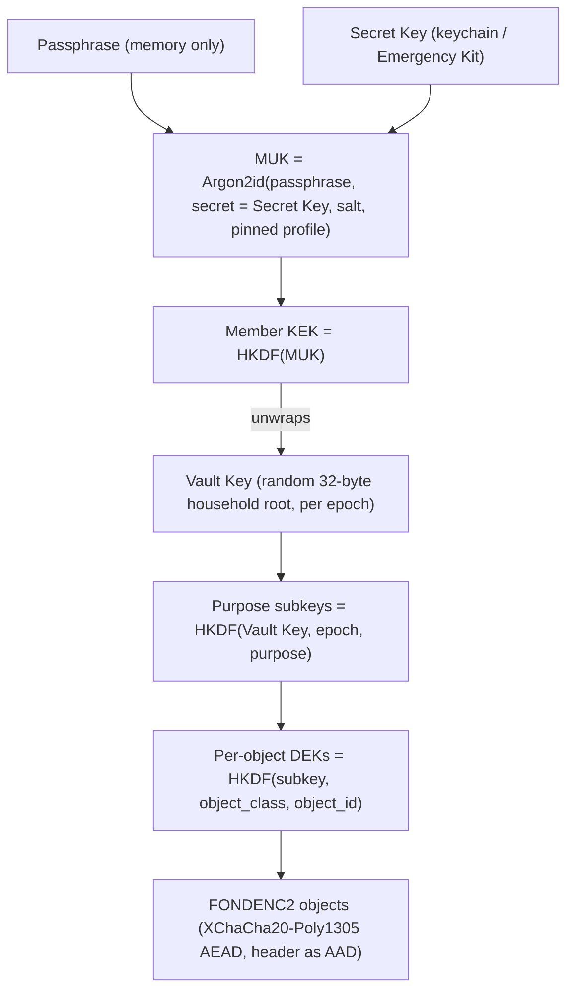

# ADR-020: On-device-first identity & the zero-knowledge account model

**Status**: Proposed
**Date**: 2026-07-24
**Decision**: Establish a **local, two-secret keyset** (passphrase + device-generated Secret Key →
Master Unlock Key → wrapped **household** Vault Key) created **lazily** on first encrypted-export or
sync opt-in — **not** an account on first run. An "account" is created only later, when the user
binds the keyset to a server (ADR-021) by attaching a PAKE verifier. Moving already-encrypted local
data to a server requires a one-time migration from today's single-key **`FONDENC1`** envelope to a
versioned **`FONDENC2`** key hierarchy (there is no key hierarchy today — see Context), after which
further transfers need no re-encryption. This keeps the README's *"no accounts, no cloud"* promise
for the default experience while making fond zero-knowledge-ready for optional sync.
**This ADR is contingent on the Epic A0 protocol spec + independent crypto review (tracked in the
ZK-Sync epic; see GitHub milestone *Zero-Knowledge Sync*);
no crypto code lands before that sign-off.** Extends ADR-005 (identity); **supersedes the single-key
model of ADR-019** by introducing a key hierarchy and `FONDENC2`.

## Context

fond is local-first with `.cook` files as the source of truth (ADR-002) and today has **no accounts
and no auth** (ADR-005 defers identity; README: *"No accounts. No cloud dependency."*). ADR-019
added opt-in symmetric encryption of the authored-overlay sidecar. **Ground truth from
`crates/fond-store/src/crypto.rs`:** `seal_bundle`/`open_bundle` seal one whole `OverlayBundle` under
a **single flat key** (raw keychain key *or* Argon2id-from-passphrase) in a `FONDENC1` envelope.
There is **no** Vault Key, no wrapped-key hierarchy, and no per-object encryption today. Two
consequences follow: (a) "no re-encryption when moving to a server" is **false as-is** — a hierarchy
must be introduced first (`FONDENC2`); (b) `open_bundle` reads Argon2 cost parameters from the
envelope header and derives **before** authenticating, a pre-auth resource-exhaustion vector when the
envelope comes from an untrusted server.

The product now wants an **optional** path to sync data across devices through a server (ADR-021),
with every synced byte end-to-end encrypted 1Password-style so no server operator can read it. That
raises a paradox: the user should be able to "create an account," but there may be no server — ever.
Where does the account live, and how do we avoid breaking the local-first, no-account promise?

The resolution must also honor **Principle #3 (family-shared)**: a household has multiple members,
so the vault must be a **multi-member** vault (per-member wrapped Vault Key, device enrollment,
revocation), not a single-person keyset. `user_id` (ADR-005) is a DB row, not a cryptographic
identity, and does not satisfy this on its own.

## Threat model

**In scope:** an attacker who later gains access to a sync server or its backups (ADR-021) must
learn nothing about recipe content, notes, or photos. Offline brute-force of a stolen server
verifier must be infeasible.

**Out of scope:** a compromised local device with keys available (OS/device hygiene, ADR-019); the
plaintext `.cook` files at rest (OS full-disk encryption, ADR-019). Losing **either** the passphrase
**or** the Secret Key is unrecoverable **by design** (both are required to derive the MUK) — mitigated
by the Emergency Kit and, *for recipes that still exist on a surviving device*, by the plaintext
`.cook` ownership backstop. The backstop does **not** recover overlay data, server-only photos, or
deleted history.

## Decision

### Identity ≠ account

- **Identity** is local and always available: a keyset that can encrypt data on-device.
- **Account** is remote and lazy: a keyset bound to a server with an auth verifier (ADR-021).

### The local keyset (two-secret model)

1. **Secret Key** — a random, high-entropy, device-generated secret. Stored in the OS keychain and
   surfaced once in an **Emergency Kit**. **Never leaves the device; never sent to any server.**
2. **Passphrase** — user-chosen; held in memory only; never stored; never sent.
3. **Master Unlock Key (MUK)** = `Argon2id(passphrase, secret=Secret Key, salt, pinned params)`.
   Never stored; re-derived on unlock. KDF profiles are **pinned/versioned**; parameters are bounded
   and authenticated **before** derivation (closes the `open_bundle` pre-auth DoS). Encodings and
   domain separation for the two secret inputs are fixed by the `FONDENC2` spec.
4. **Vault Key** — a random data key. In a household it is wrapped **once per member** (`wrapped_vault_key[member]`)
   so each member unwraps it with their own MUK; members can be enrolled and revoked without
   re-encrypting data. Purpose/epoch **subkeys** and **per-object DEKs** derive from the Vault Key, so
   a passphrase change re-wraps **one** key and key **rotation/revocation** is possible per epoch.
   The concrete construction — hierarchy, wire format, per-member wrapping, and rotation — is in
   the **Appendix: FONDENC2 protocol** below.

### Lazy creation (default = no account, encrypts nothing)

- `fond init` creates **no keyset and no account** and prints nothing about accounts. The default
  encrypted-overlay path (ADR-019) may continue to use the keychain key.
- The two-secret keyset + Emergency Kit are generated **just-in-time** the first time the user
  enables passphrase-based encrypted export or runs `fond sync setup` (ADR-021).

### Binding to a server (account is born) — see ADR-021

- Registration uses a modern **aPAKE — OPAQUE (RFC 9807) preferred**, SRP-6a only as a reviewed
  fallback (`[Validation Required]`; never hand-rolled). The server receives an OPAQUE registration
  record and public salts — never the passphrase, Secret Key, or MUK. **Service authentication is
  separated from vault authorization:** destructive or key-changing operations require a **vault-key
  signature the server cannot forge**, so a reset of the login layer never authorizes vault
  destruction.
- The `FONDENC1 → FONDENC2` migration runs once (decrypt bundle under the old flat key, split into
  per-object blobs, encrypt under Vault-Key-derived DEKs). After that, `wrapped_vault_key[member]` is
  uploaded and subsequent transfers upload already-encrypted blobs with **no re-encryption**.
- A second device logs in with email + passphrase + Secret Key (Emergency Kit / keychain export),
  proves knowledge via OPAQUE, downloads its `wrapped_vault_key`, re-derives the MUK, unwraps the
  Vault Key, pulls and decrypts blobs, verifies the signed anti-rollback manifest (ADR-021), and
  rebuilds `fond.db` via `reindex`.

### Emergency Kit & recovery

`fond identity emergency-kit` produces a printable artifact holding the Secret Key + sign-in URL.
Passphrase known **and** Secret Key available → full recovery. **Either** lost → the encrypted blob
store is unrecoverable; local plaintext `.cook` files and file-sync copies survive for recipes still
present on a device (ownership backstop), but overlay data, server-only photos, and deleted history
do not. A recovery **verification drill** (prove a restore actually works) is required before relying
on the Kit.

## Rationale

- **Keeps the promise both ways:** no account by default (README/Principle #1) *and* a real path to
  encrypted sync when wanted.
- **Lossless transfer after one migration:** the `FONDENC1 → FONDENC2` step is one-time; thereafter,
  because the Vault Key exists locally, uploading to a server never re-encrypts.
- **Two-secret strength (server-breach case):** a stolen server verifier is useless without the
  never-uploaded Secret Key, defeating **server-side** offline attacks that single-passphrase schemes
  suffer. It does **not** defend against local device compromise.
- **Family-shared:** the multi-member wrapped Vault Key satisfies Principle #3 without re-encrypting
  data when members change.
- **Reuses existing primitives** (XChaCha20-Poly1305, Argon2id, `zeroize`, keychain) but **composes a
  new protocol** — hence the mandatory Epic A0 independent review.

## Alternatives Considered

| Alternative | Rejected because |
|---|---|
| Create a real account (email+password) on first run | No server exists; breaks *"No accounts"*; forces a cloud-shaped concept on a local-first tool. |
| No identity until sync; derive keys fresh at sync time | Can't retroactively encrypt an existing local overlay under the same key; forces re-encryption and two key regimes. |
| Single passphrase, no Secret Key | Weaker: server breach + weak-passphrase offline attack compromises vaults. |
| Single-member vault (one keyset) | Fails Principle #3 (family-shared); needs a per-member wrapped Vault Key. |
| SRP-6a as the primary PAKE | A stolen SRP verifier enables offline guessing; OPAQUE (RFC 9807) is the modern aPAKE. SRP kept only as a reviewed fallback. |
| Store MUK/Secret Key on the server "for convenience" | Destroys zero-knowledge; forbidden by ADR-019. |
| Ship the key hierarchy in 1.1 before the sync use case exists | Bakes in an abstraction over both FONDENC1 modes as a migration trap; deferred behind the A0 spec + review. |
| Mandatory keyset at `init` | Breaks the frictionless local default and the no-account promise. |

## Consequences

- New `FONDENC2` key-hierarchy layer replacing the flat-key `crypto.rs` path; new `fond identity`
  command surface; Emergency Kit generator; one-time FONDENC1 migration. Passphrase-change re-wraps
  one key; member add/revoke re-wraps one key. The wire format and hierarchy are specified in the
  **Appendix: FONDENC2 protocol**.
- **Gated on Epic A0:** no crypto/sync code merges before the protocol spec is independently reviewed
  with published test vectors.
- **Honest cost:** losing *either* secret is unrecoverable; documented prominently, mitigated by the
  Kit, a verification drill, and the plaintext ownership backstop (recipes only).
- Enables ADR-021 (sync server) and ADR-023 (backup) to operate on encrypted blobs.
- ADR-013's "stable data model → 1.0" gate should be revisited for the identity/recipe-UUID columns
  this implies (tracked as issue F2/A4).
- No CI / `kafkade/github-infra` change from this ADR alone (new deps only, per ADR-019 precedent).

## Appendix: FONDENC2 protocol

This appendix specifies the concrete `FONDENC2` vault protocol that the Decision section
references but does not construct. It replaces the single flat-key `FONDENC1` envelope
(described in Context and implemented in `crates/fond-store/src/crypto.rs`) with a versioned
**key hierarchy**. Like [ADR-023's `FONDBKP1` appendix](023-backup-and-recovery.md#appendix-fondbkp1-wire-format-adr-0231),
the authoritative byte-level specification will live as module documentation in
`crates/fond-store/src/crypto.rs` **once implemented**; this appendix records the shape so the
ADR is self-contained. FONDENC2 **reuses** the already-audited AEAD primitive (`seal_blob`/
`open_blob`) for each object rather than replacing the cryptographic core.

**Gate reminder:** this is a paper spec. **No crypto/sync code lands before the Epic A0
independent review (A0.5) clears**, with published test vectors. Every `[Validation Required]`
tag below marks a choice the A0.5 reviewer must sign off on; unresolved decisions are collected
in section K rather than decided silently.

### A. Design goals

FONDENC2 closes the three gaps a single flat key leaves open, plus the pre-auth DoS:

- **Rotation & revocation** — an **epoch** counter lets the household rotate keys and revoke a
  member without re-encrypting all existing data.
- **Per-member access** — the Vault Key is wrapped **once per member** so each member unwraps
  with their own MUK; membership changes re-wrap one key, never the data (Principle #3).
- **Per-object granularity** — every object gets its own **DEK**, so objects can be added,
  rotated, and synced (ADR-021) independently.
- **No pre-auth key stretching** — object opens run **no** Argon2; the single Argon2 unlock uses
  a pinned, bounded profile, closing the `open_bundle` resource-exhaustion vector.

### B. Key hierarchy



- **L0 — secrets:** the user-chosen **passphrase** (memory only) and the device **Secret Key**
  (keychain / Emergency Kit). Both are required; neither is ever uploaded.
- **L1 — MUK:** `Argon2id` stretches the low-entropy passphrase (section C).
- **L2 — member KEK & wrapped Vault Key:** a fast HKDF of the MUK yields the member's
  key-encryption key, which wraps/unwraps that member's copy of the Vault Key (section G).
- **L3 — Vault Key:** a random 32-byte household root, one per **epoch**.
- **L4 — purpose subkeys** and **L5 — per-object DEKs:** derived from the Vault Key by HKDF with
  domain-separation labels (section F).

**KDF choice rationale.** `Argon2id` is used **only** at L1, where it stretches a low-entropy
human passphrase. Every derivation **below** the Vault Key takes a **uniformly random**
32-byte input, for which a memory-hard KDF buys nothing; a fast extract-then-expand KDF is the
correct tool. `[Validation Required]` HKDF-SHA-256 vs. a keyed BLAKE3 derive for L2/L4/L5
(open question K.4).

### C. Domain separation & the two-secret MUK

- **Label namespace.** All derivation labels are ASCII byte strings prefixed
  `fond/fondenc2/v2/...` so a subkey can never collide across purpose, epoch, protocol, or
  version. The version token (`v2`) is part of every label, binding derived keys to this spec.
- **MUK derivation.** `MUK = Argon2id(password = passphrase, secret = Secret Key, salt = per-vault
  salt, params = PROFILE[kdf_profile_id])`. The two secrets are domain-separated **by
  construction**: the passphrase occupies Argon2's `password` slot and the Secret Key occupies
  Argon2's keyed `secret` (pepper) slot — they are never concatenated into one ambiguous buffer.
- **Passphrase encoding.** UTF-8 with **NFC** normalization, so derivation is deterministic
  across devices and input methods.
- `[Validation Required]` whether to rely on Argon2's optional `secret` parameter for the Secret
  Key, or instead pre-mix with HKDF (`ikm = HKDF-Extract(salt, len_prefix(Secret Key) ‖ label)`)
  and feed a single stretched password buffer. Both are presented; A0.5 decides (open question
  K.1).

### D. Pinned KDF profiles — the authenticated-params fix

`FONDENC1`'s `open_bundle` reads free-form Argon2 `m/t/p_cost` `u32`s from an **untrusted**
header and runs Argon2id **before** authenticating — a hostile server can set enormous costs
for a pre-auth resource-exhaustion (DoS). FONDENC2 removes this structurally:

1. **Object opens run no Argon2 at all.** Per-object blobs are sealed under Vault-Key-derived
   DEKs (symmetric HKDF, microseconds). Argon2id runs **exactly once per unlock**, on the
   MUK-wrap record — never per object, never on server-supplied blobs.
2. **KDF params are a pinned, versioned profile — not free-form integers.** A single
   `kdf_profile_id` byte selects a bounded parameter set **compiled into the client**
   (`PROFILE[1] = {m_cost, t_cost, p_cost}`, …). An unknown or out-of-range id is rejected
   **before** any derivation. If raw params are also recorded for forward-compatible auditing,
   they are bound into the MUK-wrap record's AEAD associated data and MUST equal the pinned table
   entry for that id, so tampering fails closed before Argon2 runs.

Net effect: no attacker-controlled input reaches a memory-hard KDF, and no key stretching
happens on the untrusted per-object path.

### E. Envelope / wire format (per-object)

Each object is a self-describing envelope. The cleartext header is authenticated as AEAD
associated data; the DEK is **not** stored (it is re-derived from the Vault Key, epoch, and
object binding).

```text
┌─ FONDENC2 object envelope (cleartext header, authenticated as AEAD AAD) ─┐
│ magic         "FONDENC2"   8 bytes                                       │
│ version       u8           1  (2 = this FONDENC2 revision)               │
│ object_class  u8           0 = overlay, 1 = user-bucket, 2 = photo,      │
│                            3 = manifest, 4 = roster (others reserved)    │
│ epoch         u32 LE       Vault-Key epoch that derives the DEK          │
│ object_id     16 bytes     opaque per-object id (binds the DEK)          │
│ nonce         24 bytes     XChaCha20 random nonce (CSPRNG, per seal)     │
├─ Ciphertext ──────────────────────────────────────────────────────────────┤
│ AEAD(XChaCha20-Poly1305) over the object plaintext                       │
│   key = DEK = HKDF(subkey_{object_class, epoch}, object_class ‖ object_id)│
│   AAD = the entire cleartext header above                                │
└────────────────────────────────────────────────────────────────────────────┘
```

- **AAD binding (integrity of the framing).** Because the whole header — `magic`, `version`,
  `object_class`, `epoch`, `object_id`, `nonce` — is the AEAD associated data, an attacker cannot
  swap an object's `epoch` or `object_class`, or move a valid ciphertext onto a different
  `object_id`, without failing the Poly1305 tag. Envelopes fail **closed** exactly as
  `FONDENC1`/`FONDBKP1` do today.
- **Nonce safety.** XChaCha20-Poly1305's **192-bit** nonce is drawn from the system CSPRNG per
  seal. Because each object has its **own** DEK, the collision budget is **per-DEK**, not global:
  if one DEK re-seals its object `N` times, the birthday probability of a nonce collision is
  ≈ `N² / 2¹⁹³` — e.g. `N = 2³²` rewrites gives ≈ `2⁻¹²⁹`, negligible. This is the standard
  extended-nonce (XSalsa/XChaCha) argument that makes **random** nonces safe **under a sound
  RNG**, without a counter. `[Validation Required]` whether to additionally adopt a per-DEK
  monotonic counter as defense-in-depth against RNG failure (open question K.5).
- **Version byte.** The `magic` distinguishes formats; the `version` byte tracks this format's
  own revision (`2`, aligned with the magic). `FONDENC1` remains readable via its own magic for
  the one-time migration (section I).

### F. Per-object DEK derivation & object granularity

- **Extract once:** `PRK_vault = HKDF-Extract(salt = "fond/fondenc2/v2/vault", ikm = Vault Key)`.
- **Purpose/epoch subkey:**
  `subkey_{purpose,epoch} = HKDF-Expand(PRK_vault, "fond/fondenc2/v2/subkey" ‖ purpose ‖ epoch_le, 32)`.
- **Per-object DEK:**
  `DEK = HKDF-Expand(subkey_{object_class,epoch}, "fond/fondenc2/v2/dek" ‖ object_class ‖ object_id, 32)`.

Purpose labels (domain-separated, non-exhaustive):

| Purpose label | Derives | Consumed by |
|---|---|---|
| `content` | overlay/user-bucket object DEKs | authored overlay (ADR-015) |
| `photo` | photo object DEKs | content-addressed photos |
| `manifest` | manifest MAC/enc key | signed sync manifest (ADR-021) |
| `object-id` | HMAC namespace key | opaque blob identifiers (ADR-021) |
| `roster` | roster MAC key | member roster (section G) |

- **Object granularity.** An "object" aligns with **ADR-021's sync unit** (one encrypted blob).
  Object classes: overlay record(s), per-user bucket, photo, manifest, roster. `[Validation
  Required]` the final overlay granularity — per-recipe-overlay vs. per-overlay-row vs.
  per-user-bucket — trades metadata/blob count against rotation cost (open question K.6). Photos
  are naturally per-file.

### G. Per-member Vault Key wrapping & the roster

- **Member keys.** At enrollment each member generates, locally: an **MUK** (from their own
  passphrase + Secret Key), a **KEK** = `HKDF-Expand(HKDF-Extract(_, MUK), "fond/fondenc2/v2/kek", 32)`,
  and an **identity keypair** — **X25519** (invitation transport) plus **Ed25519** (roster/manifest
  signing).
- **Wrapping.** `wrapped_vault_key[member] = wrap(Vault Key, key = KEK_member, aad = roster
  binding)`. `[Validation Required]` the wrap construction: XChaCha20-Poly1305 keywrap vs.
  AES-256-KW (RFC 3394) vs. nonce-misuse-resistant AES-SIV (RFC 5297) (open question K.2).
- **Roster object.** An authenticated, hash-chained record:
  `{ vault_id, current_epoch, members: [{ member_id, role, x25519_pub, ed25519_pub,
  wrapped_vault_key[epoch] }], prev_roster_hash }`, signed by an owner/admin Ed25519 key. The
  `prev_roster_hash` chain makes roster history tamper- and rollback-evident, dovetailing with
  ADR-021's signed manifest. The roster is itself a FONDENC2 object (`object_class = roster`); it
  carries only pseudonymous ids, public keys, and ciphertext wraps — never plaintext content.
  `[Validation Required]` whether the roster signer is a dedicated vault Ed25519 key or per-admin
  keys with a threshold, and how ownership transfers (open question K.8).

### H. Enrollment, roles, invitation, revocation, epoch rotation

- **Device enrollment (same member, new device).** Transport the Secret Key via Emergency Kit /
  keychain export; the new device re-derives the MUK (passphrase + Secret Key), pulls the roster,
  and unwraps its `wrapped_vault_key` with its KEK. No new roster entry (same identity).
  `[Validation Required]` whether each device gets its own subkey/signing key for per-device
  revocation (open question K.7).
- **Roles.** `owner` (bootstraps the vault, transfers ownership, invites/revokes, rotates),
  `admin` (invites/revokes, rotates), `member` (reads/writes data, no membership changes). Under
  zero-knowledge the server cannot enforce content authorization, so roles are **cryptographic**:
  only an owner/admin Ed25519 signature produces a roster the other clients will accept.
- **Invitation (new member).** The invitee generates their X25519 + Ed25519 identity locally and
  publishes the **public** keys (out-of-band or via the server). An owner/admin performs a
  **sealed-box** invitation — `sealed = seal(Vault Key, invitee_x25519_pub)` (X25519 +
  XChaCha20-Poly1305, ephemeral sender key) — which **only** the invitee's X25519 secret can
  open. The invitee then re-wraps the Vault Key under their own KEK and the admin adds their
  signed roster entry. The plaintext Vault Key is never exposed to the server. `[Validation
  Required]` the sealed-box construction (libsodium `crypto_box_seal` vs. HPKE, RFC 9180) — prefer
  a reviewed standard (open question K.3).
- **Revocation = epoch rotation (no bulk re-encryption).**
  1. An owner/admin generates a **new** Vault Key `VK_{e+1}` and bumps the epoch `e → e+1`.
  2. Re-wraps `VK_{e+1}` for the **remaining** members only (each KEK); the revoked member gets
     no wrap.
  3. Publishes a new signed roster at epoch `e+1` with the revoked member removed.
  4. All **new** writes derive DEKs from `VK_{e+1}`; **existing** objects stay under `VK_e` and
     are **not** re-encrypted.
- **Honest revocation limit.** Because existing data is not re-encrypted, a revoked member who
  retained `VK_e` (or the old-epoch ciphertext they already downloaded) can still decrypt
  **everything that existed at the moment of revocation**. Epoch rotation protects only data
  written **after** revocation; it does **not** retroactively protect past data. This is inherent
  to any revocation that avoids bulk re-encryption, and is stated plainly rather than implied
  away. `[Validation Required]` optional **lazy/background re-encryption** — opportunistically
  re-seal old-epoch objects under the current epoch on next write or a background pass — which
  **shrinks but cannot eliminate** the exposure window (the member already saw plaintext) (open
  question K.9).
- **Passphrase change / Secret Key rotation.** Re-derives MUK → re-derives KEK → re-wraps the
  member's single `wrapped_vault_key`. One wrap, **no** data re-encryption (matches the Decision's
  "passphrase change re-wraps one key").

### I. `FONDENC1` → `FONDENC2` migration (one-time)

- **Trigger & detection.** Runs on the first `fond sync setup` / first hierarchy-backed encrypted
  export; a `FONDENC1` blob is detected by its magic.
- **Steps.** (1) Open the single `FONDENC1` bundle with the existing `KeyMaterial` (keychain raw
  key or passphrase) via `open_bundle`. (2) Generate the Vault Key and an epoch-0 roster, wrapped
  for the initial (owner) member. (3) Split the `OverlayBundle` into per-object plaintext units by
  the chosen granularity (section F). (4) Seal each unit as a `FONDENC2` object under its
  Vault-Key-derived DEK at epoch 0. (5) Retain or securely delete the legacy `FONDENC1` blob per
  user choice.
- **Idempotent & lossless.** Re-running detects already-migrated state (a `FONDENC2` object
  present) and no-ops; existing user edits are never overwritten (import-idempotency house rule).
  The `.cook` files — the source of truth (ADR-002) — are untouched; migration only re-frames the
  derived overlay/photo blobs.

### J. Primitives

| Primitive | Role in FONDENC2 | Status |
|---|---|---|
| Argon2id | MUK stretch (L1), pinned bounded profiles | Named |
| HKDF-SHA-256 | KEK / subkey / DEK derivation (L2, L4, L5) | Named; `[Validation Required]` vs. keyed BLAKE3 (K.4) |
| XChaCha20-Poly1305 | per-object AEAD; candidate key-wrap | Named |
| X25519 | sealed-box invitation transport | Named; sealed-box construction `[Validation Required]` (K.3) |
| Ed25519 | roster/manifest signing, role authorization | Named; signer/threshold model `[Validation Required]` (K.8) |
| HMAC-SHA-256 | opaque object-id namespace (ADR-021) | Named |
| OPAQUE (RFC 9807) | account/PAKE server binding | Referenced (ADR-020/021), not redefined here |
| Vault-Key wrap | wrapping `wrapped_vault_key[member]` | `[Validation Required]` XChaCha20-Poly1305 vs. AES-256-KW vs. AES-SIV (K.2) |

None of these are hand-rolled or novel; FONDENC2 is a **composition** of reviewed primitives,
which is precisely why the A0.5 independent review is mandatory before any implementation.

### K. Open questions for A0.5 (independent crypto review)

1. **MUK two-secret binding** — Argon2 `secret` (pepper) parameter vs. an explicit HKDF pre-mix
   into one stretched password buffer (section C).
2. **Vault-Key wrap construction** — XChaCha20-Poly1305 keywrap vs. AES-256-KW (RFC 3394) vs.
   AES-SIV (RFC 5297) (section G).
3. **Sealed-box invitation** — libsodium `crypto_box_seal` vs. HPKE (RFC 9180) (section H).
4. **Subkey/DEK KDF** — HKDF-SHA-256 vs. keyed BLAKE3 derivation (sections B, F).
5. **Nonce strategy** — pure-random 192-bit vs. an additional per-DEK counter as RNG-failure
   defense-in-depth (section E).
6. **Object granularity** — per-recipe-overlay vs. per-overlay-row vs. per-user-bucket (section
   F).
7. **Per-device keys** — per-device subkeys/signing keys enabling per-device revocation vs.
   per-member only (section H).
8. **Roster signer & role model** — dedicated vault Ed25519 key vs. per-admin keys/threshold;
   ownership-transfer mechanics (section G).
9. **Lazy/background re-encryption** — opportunistic old-epoch re-sealing to shrink (never
   eliminate) the post-revocation exposure window (section H).
10. **Identity ↔ OPAQUE binding** — how the X25519/Ed25519 vault identity keys bind to the OPAQUE
    login record (ADR-021) so a login-layer reset cannot forge vault authorization (extends the
    Decision's "service auth separated from vault authorization").
11. **`object_id` source & width** — ADR-021's keyed-HMAC blob id vs. a per-object random id; 16
    vs. 32 bytes (sections E, F).
12. **Emergency Kit contents** — confirm the Kit carries the **Secret Key only** (the MUK is
    re-derived) and prints **no** Vault Key material (section on Emergency Kit & recovery).
